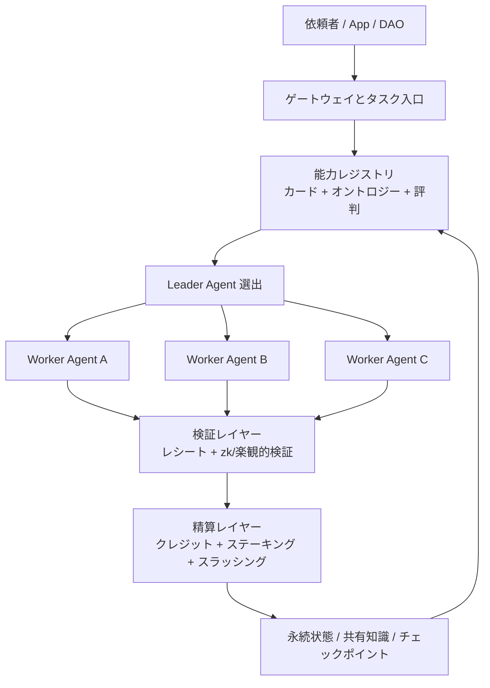

<p align="center">
  
</p>

<h1 align="center">AgentCoin</h1>

<p align="center">
  <strong>Web 4.0 時代に向けた、分散型エージェント協調ネットワーク。</strong>
</p>

<p align="center">
  <a href="README.md">English</a>
  ·
  <a href="README.zh-CN.md">简体中文</a>
  ·
  <a href="README.ja.md">日本語</a>
</p>

<p align="center">
  <a href="docs/whitepaper/ja.md">ホワイトペーパー</a>
  ·
  <a href="docs/whitepaper/en.md">English Whitepaper</a>
  ·
  <a href="docs/whitepaper/zh-CN.md">中文白皮书</a>
</p>

## 概要

AgentCoin は、単一フレームワークや単一ベンダーに閉じた AI エージェントを、相互運用可能な分散ネットワークへ変えるための構想です。異なるノード上のエージェントが、能力を公開し、タスクを分解し、協調実行し、結果を検証し、価値を精算できる基盤を目指します。

設計は次の 4 層で構成されます。

- `相互運用層`: エージェントカード、共有オントロジー、標準インターフェース
- `PoAW 経済層`: 有用な仕事に対する報酬設計
- `スウォーム調整層`: ルーティング、リーダー選出、チーム編成
- `安全実行層`: ゲートウェイ、サンドボックス、検証、スラッシング

## アーキテクチャ



## ドキュメント

| 言語 | ランディングページ | ホワイトペーパー |
| --- | --- | --- |
| 日本語 | [README.ja.md](README.ja.md) | [docs/whitepaper/ja.md](docs/whitepaper/ja.md) |
| English | [README.md](README.md) | [docs/whitepaper/en.md](docs/whitepaper/en.md) |
| 简体中文 | [README.zh-CN.md](README.zh-CN.md) | [docs/whitepaper/zh-CN.md](docs/whitepaper/zh-CN.md) |

## 現在の状態

このリポジトリは現在、ホワイトペーパーとアーキテクチャ定義の段階です。次の実装目標は、ノード登録、タスク分配、状態永続化、ツール実行検証、報酬精算までを一連で成立させる MVP です。

## 参照実装

このリポジトリには、Python 3.11 標準ライブラリのみで動く軽量な参照ノードも含まれています。

- `クロスプラットフォーム`: macOS、Linux、Windows、WSL で動作
- `軽量`: 追加ランタイム依存を極力排除
- `オフライン優先`: SQLite による task / inbox / outbox 永続化
- `安全寄りの初期設定`: デフォルトで `127.0.0.1` に bind し、書き込み系 API は Bearer Token 保護
- `多様な Agent との互換性`: 汎用 task envelope と capability card を採用

### Quick Start

```bash
python -m venv .venv
. .venv/bin/activate
pip install -e .
agentcoin-node --config configs/node.example.json
```

Windows PowerShell:

```powershell
python -m venv .venv
.venv\Scripts\Activate.ps1
pip install -e .
agentcoin-node --config configs/node.example.json
```

主な endpoint:

- `GET /healthz`
- `GET /v1/card`
- `GET /v1/tasks`
- `GET /v1/peers`
- `GET /v1/peer-cards`
- `POST /v1/tasks`
- `POST /v1/tasks/dispatch`
- `POST /v1/tasks/claim`
- `POST /v1/tasks/lease/renew`
- `POST /v1/tasks/ack`
- `POST /v1/inbox`
- `POST /v1/outbox/flush`
- `POST /v1/peers/sync`

暗号化 overlay 上の設定済み peer に配送する場合は、task の `deliver_to` に `configs/node.example.json` の `peer_id` を指定します。例: `agentcoin-peer-b`。

peer capability card の同期と確認:

```bash
curl -X POST http://127.0.0.1:8080/v1/peers/sync -H "Authorization: Bearer change-me"
curl http://127.0.0.1:8080/v1/peer-cards
```

ローカル task queue は lease-based coordination にも対応しました。

- `POST /v1/tasks/claim`
- `POST /v1/tasks/lease/renew`
- `POST /v1/tasks/ack`

これは複数 agent による task coordination の土台です。

inter-node message delivery には explicit ACK も追加しました。

- inbox は `message_id` で idempotent
- receiver は `ack` を返す
- outbox は有効な ACK を受けたときだけ delivered になります

最小の planner dispatch も追加しました。

- `POST /v1/tasks/dispatch`
- `required_capabilities` に基づいて peer card から target を選択
- peer が見つからず local が対応可能なら local queue に残す

最小 worker pull loop:

```bash
agentcoin-worker \
  --node-url http://127.0.0.1:8080 \
  --token change-me \
  --worker-id worker-1 \
  --capability worker
```
