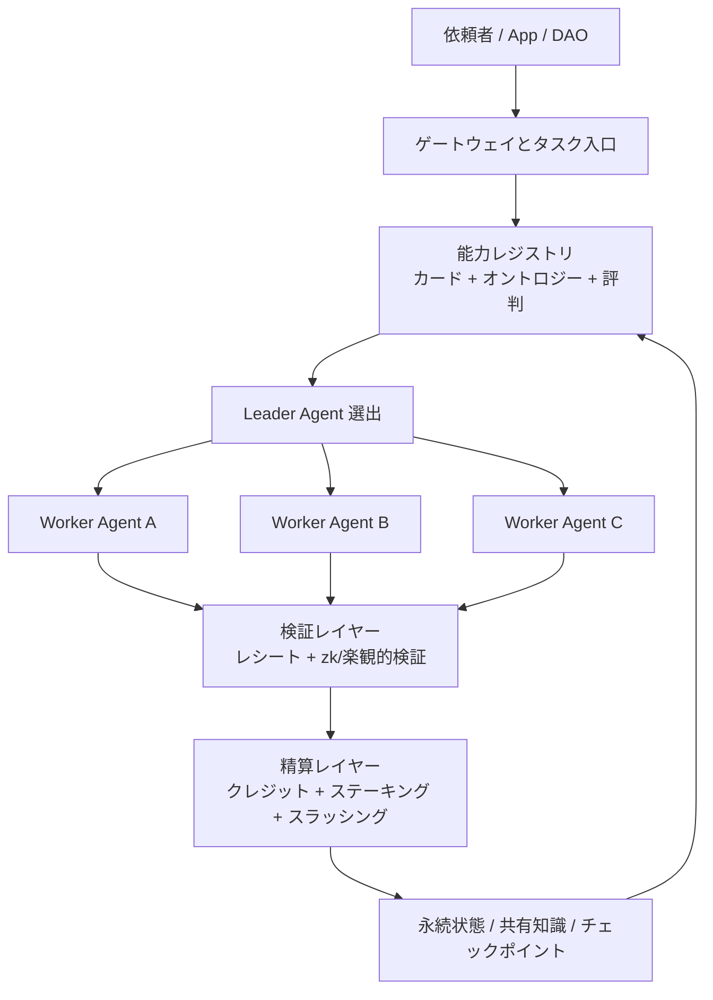

<p align="center">
  
</p>

<h1 align="center">AgentCoin</h1>

<p align="center">
  <strong>Web 4.0 時代に向けた、分散型エージェント協調ネットワーク。</strong>
</p>

<p align="center">
  <a href="README.md">English</a>
  ·
  <a href="README.zh-CN.md">简体中文</a>
  ·
  <a href="README.ja.md">日本語</a>
</p>

<p align="center">
  <a href="docs/whitepaper/ja.md">ホワイトペーパー</a>
  ·
  <a href="docs/project/overview.md">Project Docs</a>
  ·
  <a href="docs/testing/strategy.md">Testing Docs</a>
  ·
  <a href="docs/legal/gpl-notice.md">GPL Notice</a>
  ·
  <a href="docs/whitepaper/en.md">English Whitepaper</a>
  ·
  <a href="docs/whitepaper/zh-CN.md">中文白皮书</a>
</p>

## 概要

AgentCoin は、単一フレームワークや単一ベンダーに閉じた AI エージェントを、相互運用可能な分散ネットワークへ変えるための構想です。異なるノード上のエージェントが、能力を公開し、タスクを分解し、協調実行し、結果を検証し、価値を精算できる基盤を目指します。

設計は次の 4 層で構成されます。

- `相互運用層`: エージェントカード、共有オントロジー、標準インターフェース
- `PoAW 経済層`: 有用な仕事に対する報酬設計
- `スウォーム調整層`: ルーティング、リーダー選出、チーム編成
- `安全実行層`: ゲートウェイ、サンドボックス、検証、スラッシング

## アーキテクチャ



## ドキュメント

| 言語 | ランディングページ | ホワイトペーパー |
| --- | --- | --- |
| 日本語 | [README.ja.md](README.ja.md) | [docs/whitepaper/ja.md](docs/whitepaper/ja.md) |
| English | [README.md](README.md) | [docs/whitepaper/en.md](docs/whitepaper/en.md) |
| 简体中文 | [README.zh-CN.md](README.zh-CN.md) | [docs/whitepaper/zh-CN.md](docs/whitepaper/zh-CN.md) |

## 追加ドキュメント

- Project documentation: [docs/project/overview.md](docs/project/overview.md)
- Testing documentation: [docs/testing/strategy.md](docs/testing/strategy.md)
- Architecture notes: [docs/architecture/mvp.md](docs/architecture/mvp.md)
- Connectivity notes: [docs/architecture/e2ee-connectivity.md](docs/architecture/e2ee-connectivity.md)
- GPL notice: [docs/legal/gpl-notice.md](docs/legal/gpl-notice.md)
- License text: [LICENSE](LICENSE)

## 現在の状態

このリポジトリは現在、ホワイトペーパーとアーキテクチャ定義の段階です。次の実装目標は、ノード登録、タスク分配、状態永続化、ツール実行検証、報酬精算までを一連で成立させる MVP です。

## 参照実装

このリポジトリには、Python 3.11 標準ライブラリのみで動く軽量な参照ノードも含まれています。

- `クロスプラットフォーム`: macOS、Linux、Windows、WSL で動作
- `軽量`: 追加ランタイム依存を極力排除
- `オフライン優先`: SQLite による task / inbox / outbox 永続化
- `安全寄りの初期設定`: デフォルトで `127.0.0.1` に bind し、書き込み系 API は Bearer Token 保護
- `多様な Agent との互換性`: 汎用 task envelope と capability card を採用

### Quick Start

```bash
python -m venv .venv
. .venv/bin/activate
pip install -e .
agentcoin-node --config configs/node.example.json
```

Windows PowerShell:

```powershell
python -m venv .venv
.venv\Scripts\Activate.ps1
pip install -e .
agentcoin-node --config configs/node.example.json
```

自動テスト:

```bash
python -m unittest discover -s tests -v
```

GitHub Actions CI は現在 macOS / Linux / Windows で syntax check と `unittest` を実行します。

主な endpoint:

- `GET /healthz`
- `GET /v1/card`
- `GET /v1/tasks`
- `GET /v1/tasks/dead-letter`
- `GET /v1/workflows?workflow_id=...`
- `GET /v1/workflows/summary?workflow_id=...`
- `GET /v1/peers`
- `GET /v1/peer-cards`
- `GET /v1/outbox`
- `GET /v1/outbox/dead-letter`
- `POST /v1/tasks`
- `POST /v1/tasks/dispatch`
- `POST /v1/workflows/fanout`
- `POST /v1/workflows/review-gate`
- `POST /v1/workflows/merge`
- `POST /v1/workflows/finalize`
- `POST /v1/tasks/claim`
- `POST /v1/tasks/lease/renew`
- `POST /v1/tasks/ack`
- `POST /v1/inbox`
- `POST /v1/outbox/flush`
- `POST /v1/tasks/requeue`
- `POST /v1/outbox/requeue`
- `POST /v1/peers/sync`

暗号化 overlay 上の設定済み peer に配送する場合は、task の `deliver_to` に `configs/node.example.json` の `peer_id` を指定します。例: `agentcoin-peer-b`。

peer capability card の同期と確認:

```bash
curl -X POST http://127.0.0.1:8080/v1/peers/sync -H "Authorization: Bearer change-me"
curl http://127.0.0.1:8080/v1/peer-cards
```

ローカル task queue は lease-based coordination にも対応しました。

- `POST /v1/tasks/claim`
- `POST /v1/tasks/lease/renew`
- `POST /v1/tasks/ack`

これは複数 agent による task coordination の土台です。

inter-node message delivery には explicit ACK も追加しました。

- inbox は `message_id` で idempotent
- receiver は `ack` を返す
- outbox は有効な ACK を受けたときだけ delivered になります

弱いネットワークや失敗時の扱いも追加しました。

- outbox は `pending -> retrying` と指数バックオフで再送
- `outbox_max_attempts` を超えると outbox dead-letter に移動
- `local_dispatch_fallback=true` かつ local capability が足りる場合、失敗した remote dispatch は `fallback-local` に切り替え
- それ以外は task 自体が dead-letter に移動し、後から replay できます

task retry も明示的になりました。

- task は `max_attempts`, `retry_backoff_seconds`, `available_at`, `last_error` を持つ
- `POST /v1/tasks/ack` に `requeue=true` を渡すと即時再取得ではなく遅延再試行になる
- retry budget を使い切ると task は `dead-letter` になる
- `POST /v1/tasks/requeue` と `POST /v1/outbox/requeue` で再投入できます

最小の planner dispatch も追加しました。

- `POST /v1/tasks/dispatch`
- `required_capabilities` に基づいて peer card から target を選択
- peer が見つからず local が対応可能なら local queue に残す

最小 worker pull loop:

```bash
agentcoin-worker \
  --node-url http://127.0.0.1:8080 \
  --token change-me \
  --worker-id worker-1 \
  --capability worker
```

task には Git-like な workflow traits も追加しました。

- `workflow_id`
- `parent_task_id`
- `branch`
- `revision`
- `merge_parent_ids`
- `commit_message`
- `depends_on`

これにより task は単なる flat queue ではなく DAG として扱えます。

workflow の収束フェーズも追加しました。

- `POST /v1/workflows/review-gate` で target branch task を承認・却下する reviewer task を生成
- `POST /v1/workflows/merge` で複数 branch task に依存する merge / aggregate / reviewer task を生成
- `GET /v1/workflows/summary?workflow_id=...` で branch, role, status, ready, blocked, leaf task を要約表示
- `POST /v1/workflows/finalize` で open task がなくなった workflow の終端状態を永続化
- planner が `fanout` を実行すると親 task は自動で completed になり、root が queued のまま残りません

protected merge もサポートしました。

- merge task は `protected_branches` を宣言できる
- 各 protected branch は merge の前に reviewer approval を要求できる
- workflow summary は `review_task_ids`, `review_approvals`, `merge_gate_status` を返す

## Test Status

現在のリポジトリには、自動 `unittest` とクロスプラットフォーム GitHub Actions CI が含まれており、retry, dead-letter, delivery ACK, workflow merge/finalize, 弱ネットワーク fallback を検証します。

## License

This repository is licensed under the GNU General Public License v3.0 or later. See [LICENSE](LICENSE) and [docs/legal/gpl-notice.md](docs/legal/gpl-notice.md).
