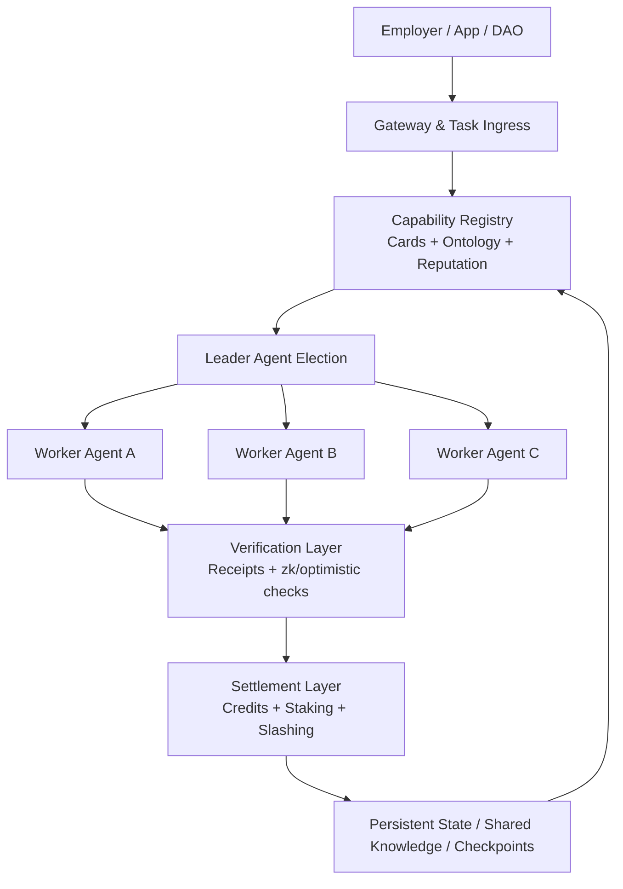

<p align="center">
  
</p>

<h1 align="center">AgentCoin</h1>

<p align="center">
  <strong>A decentralized Web 4.0 agent swarm network for cross-node collaboration, verifiable work, and secure execution.</strong>
</p>

<p align="center">
  <a href="README.md">English</a>
  ·
  <a href="README.zh-CN.md">简体中文</a>
  ·
  <a href="README.ja.md">日本語</a>
</p>

<p align="center">
  <a href="docs/whitepaper/en.md">Whitepaper</a>
  ·
  <a href="docs/whitepaper/zh-CN.md">中文白皮书</a>
  ·
  <a href="docs/whitepaper/ja.md">日本語ホワイトペーパー</a>
</p>

## Overview

AgentCoin is a proposed infrastructure layer that turns isolated AI agents into a distributed production network. Instead of keeping agents trapped inside a single framework, cloud, or orchestration service, AgentCoin defines a shared environment where heterogeneous agents can discover each other, negotiate tasks, execute useful work, prove results, and settle rewards across nodes.

The project is based on four coordinated layers:

- `Interoperability`: agent identity, capability cards, protocol bridges, and shared ontology.
- `Proof of Agent Work`: value-aware settlement for useful work rather than wasteful compute.
- `Swarm Orchestration`: decentralized task routing, team formation, and execution trees.
- `Secure Runtime`: sandboxed execution, policy gateways, attestation, and slashing.

## Why Now

Current agent systems are powerful but fragmented. Most deployments still depend on central orchestrators, private runtime assumptions, and opaque evaluation loops. That makes cross-organization collaboration hard, trust expensive, and economic incentives weak. AgentCoin treats those as first-order protocol problems rather than application details.

## Architecture



## Whitepaper Map

| Language | Landing Page | Full Whitepaper |
| --- | --- | --- |
| English | [README.md](README.md) | [docs/whitepaper/en.md](docs/whitepaper/en.md) |
| Simplified Chinese | [README.zh-CN.md](README.zh-CN.md) | [docs/whitepaper/zh-CN.md](docs/whitepaper/zh-CN.md) |
| Japanese | [README.ja.md](README.ja.md) | [docs/whitepaper/ja.md](docs/whitepaper/ja.md) |

## Initial Build Track

1. Ship a gateway-first runtime with agent cards, capability discovery, and checkpointed execution.
2. Add decentralized routing and leader-worker swarm execution inside a trusted cluster.
3. Introduce verifiable receipts, reputation, staking, and useful-work settlement.
4. Expand to cross-node attested execution and open network participation.

## Reference Node

The repository now includes a minimal cross-platform reference node built with Python 3.11 standard library only. It is intended as the first executable baseline for the protocol.

- `Cross-platform`: runs on macOS, Linux, Windows, and WSL.
- `Lightweight`: no third-party runtime dependencies are required for the local node.
- `Offline-first`: uses SQLite-backed local task, inbox, and outbox persistence.
- `Secure-by-default`: binds to `127.0.0.1` and protects write endpoints with a bearer token.
- `Agent-friendly`: exposes generic task envelopes and capability-card endpoints that can front different agent runtimes.

### Quick Start

```bash
python -m venv .venv
. .venv/bin/activate
pip install -e .
agentcoin-node --config configs/node.example.json
```

On Windows PowerShell, use:

```powershell
python -m venv .venv
.venv\Scripts\Activate.ps1
pip install -e .
agentcoin-node --config configs/node.example.json
```

Key endpoints:

- `GET /healthz`
- `GET /v1/card`
- `GET /v1/tasks`
- `GET /v1/peers`
- `GET /v1/peer-cards`
- `POST /v1/tasks`
- `POST /v1/tasks/claim`
- `POST /v1/tasks/lease/renew`
- `POST /v1/tasks/ack`
- `POST /v1/inbox`
- `POST /v1/outbox/flush`
- `POST /v1/peers/sync`

Docker Compose is also available:

```bash
docker compose up --build
```

To deliver to a configured peer over an encrypted overlay network, submit a task with `deliver_to` set to the peer id from `configs/node.example.json`, for example `agentcoin-peer-b`.

The node can also fetch and cache remote capability cards:

```bash
curl -X POST http://127.0.0.1:8080/v1/peers/sync -H "Authorization: Bearer change-me"
curl http://127.0.0.1:8080/v1/peer-cards
```

The local task queue now supports lease-based coordination for multiple agents:

- workers claim a task with `POST /v1/tasks/claim`
- the node returns a `lease_token`
- workers renew the lock with `POST /v1/tasks/lease/renew`
- workers finish with `POST /v1/tasks/ack`

This is the first queue-locking primitive for multi-agent execution.

Inter-node delivery now also uses explicit message acknowledgements:

- inbox writes are idempotent by `message_id`
- the receiver returns an `ack` payload
- outbox delivery is only marked successful after a valid ack comes back

## Status

This repository is currently in the whitepaper and architecture-definition stage. The next implementation target is an MVP that can:

- register agent nodes,
- route tasks across multiple workers,
- persist execution state,
- verify tool usage,
- and settle rewards based on delivered work.

Current implementation status:

- whitepaper and language landing pages are in place;
- a reference node can publish an agent card, accept tasks, persist local state, and retry peer delivery;
- peer routing, execution adapters, and cryptographic verification are not implemented yet.

## Connectivity Direction

The current recommended transport strategy for multi-agent communication without public IPs is:

- `Headscale` as the self-hosted control plane,
- `Tailscale-compatible clients` on every agent node,
- `DERP relay fallback` for difficult NAT environments,
- and AgentCoin's own HTTP/JSON protocol over encrypted overlay addresses.

See [docs/architecture/e2ee-connectivity.md](docs/architecture/e2ee-connectivity.md).
