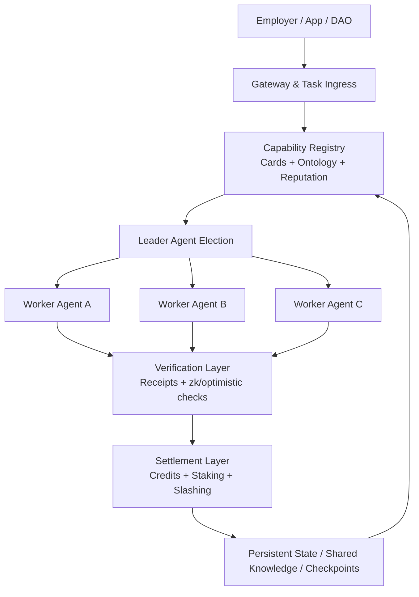

<p align="center">
  
</p>

<h1 align="center">AgentCoin</h1>

<p align="center">
  <strong>A decentralized Web 4.0 agent swarm network for cross-node collaboration, verifiable work, and secure execution.</strong>
</p>

<p align="center">
  <a href="README.md">English</a>
  ·
  <a href="README.zh-CN.md">简体中文</a>
  ·
  <a href="README.ja.md">日本語</a>
</p>

<p align="center">
  <a href="docs/whitepaper/en.md">Whitepaper</a>
  ·
  <a href="docs/project/overview.md">Project Docs</a>
  ·
  <a href="docs/testing/strategy.md">Testing Docs</a>
  ·
  <a href="docs/legal/gpl-notice.md">GPL Notice</a>
  ·
  <a href="docs/whitepaper/zh-CN.md">中文白皮书</a>
  ·
  <a href="docs/whitepaper/ja.md">日本語ホワイトペーパー</a>
</p>

## Overview

AgentCoin is a proposed infrastructure layer that turns isolated AI agents into a distributed production network. Instead of keeping agents trapped inside a single framework, cloud, or orchestration service, AgentCoin defines a shared environment where heterogeneous agents can discover each other, negotiate tasks, execute useful work, prove results, and settle rewards across nodes.

The project is based on four coordinated layers:

- `Interoperability`: agent identity, capability cards, protocol bridges, and shared ontology.
- `Proof of Agent Work`: value-aware settlement for useful work rather than wasteful compute.
- `Swarm Orchestration`: decentralized task routing, team formation, and execution trees.
- `Secure Runtime`: sandboxed execution, policy gateways, attestation, and slashing.

## Why Now

Current agent systems are powerful but fragmented. Most deployments still depend on central orchestrators, private runtime assumptions, and opaque evaluation loops. That makes cross-organization collaboration hard, trust expensive, and economic incentives weak. AgentCoin treats those as first-order protocol problems rather than application details.

## Architecture



## Whitepaper Map

| Language | Landing Page | Full Whitepaper |
| --- | --- | --- |
| English | [README.md](README.md) | [docs/whitepaper/en.md](docs/whitepaper/en.md) |
| Simplified Chinese | [README.zh-CN.md](README.zh-CN.md) | [docs/whitepaper/zh-CN.md](docs/whitepaper/zh-CN.md) |
| Japanese | [README.ja.md](README.ja.md) | [docs/whitepaper/ja.md](docs/whitepaper/ja.md) |

## Documentation Map

- Project documentation: [docs/project/overview.md](docs/project/overview.md)
- Testing documentation: [docs/testing/strategy.md](docs/testing/strategy.md)
- Architecture notes: [docs/architecture/mvp.md](docs/architecture/mvp.md)
- Agent adapter strategy: [docs/architecture/agent-adapters.md](docs/architecture/agent-adapters.md)
- OpenClaw integration: [docs/integrations/openclaw.md](docs/integrations/openclaw.md)
- On-chain roadmap: [docs/architecture/onchain-roadmap.md](docs/architecture/onchain-roadmap.md)
- Blueprint alignment: [docs/architecture/alignment-gap.md](docs/architecture/alignment-gap.md)
- Connectivity notes: [docs/architecture/e2ee-connectivity.md](docs/architecture/e2ee-connectivity.md)
- Contracts scaffold: [contracts/README.md](contracts/README.md)
- GPL notice: [docs/legal/gpl-notice.md](docs/legal/gpl-notice.md)
- License text: [LICENSE](LICENSE)

## Initial Build Track

1. Ship a gateway-first runtime with agent cards, capability discovery, and checkpointed execution.
2. Add decentralized routing and leader-worker swarm execution inside a trusted cluster.
3. Introduce verifiable receipts, reputation, staking, and useful-work settlement.
4. Expand to cross-node attested execution and open network participation.

## Reference Node

The repository now includes a minimal cross-platform reference node built with Python 3.11 standard library only. It is intended as the first executable baseline for the protocol.

- `Cross-platform`: runs on macOS, Linux, Windows, and WSL.
- `Lightweight`: no third-party runtime dependencies are required for the local node.
- `Offline-first`: uses SQLite-backed local task, inbox, and outbox persistence.
- `Secure-by-default`: binds to `127.0.0.1` and protects write endpoints with a bearer token.
- `Signed transport`: capability cards and task envelopes can carry HMAC signatures for peer verification.
- `Asymmetric identity`: nodes can also sign cards, task envelopes, and delivery receipts with `ssh-keygen` compatible Ed25519 keys.
- `Agent-friendly`: exposes generic task envelopes and capability-card endpoints that can front different agent runtimes.

The repository now also includes a first on-chain scaffold for the BNB Chain track:

- `AgentDIDRegistry`: portable agent identity and simple reputation anchor
- `StakingPool`: native BNB stake, lock, unlock, and slash flow
- `BountyEscrow`: funded jobs, worker acceptance, submission, completion, rejection, refund, and slash flow

The Python node now also has a first on-chain integration skeleton:

- `attach_onchain_context=true` can bind `spec_hash`, `job_id`, and contract references to a task
- `GET /v1/onchain/status` exposes the local BNB Chain binding
- `POST /v1/onchain/task-bind` can attach or update on-chain job metadata for an existing task
- successful task ACKs can emit a signed `_onchain_receipt` carrying `submission_hash`, `result_hash`, `receipt_uri`, and intended contract action
- `POST /v1/onchain/intents/build` can build signed EVM transaction intents for `createJob`, `acceptJob`, `submitWork`, `completeJob`, `rejectJob`, and `slashJob`
- `POST /v1/onchain/rpc-payload` can build signed JSON-RPC payload skeletons for `eth_sendTransaction`, `eth_estimateGas`, and `eth_call`
- `POST /v1/onchain/rpc-plan` can resolve live nonce, gas price, and gas estimates through JSON-RPC before an external signer or wallet submits the transaction
- `POST /v1/onchain/rpc/send-raw` can relay an externally signed raw transaction to the configured RPC endpoint

The node now also has a unified outbound transport layer for weak-network and VPN/proxy-heavy environments:

- explicit `http_proxy` / `https_proxy` configuration for peer sync, outbox delivery, worker API calls, and future chain RPC traffic
- `no_proxy_hosts` rules support exact hosts, suffixes like `.tailnet.internal`, and CIDR blocks like `100.64.0.0/10`
- loopback traffic is always kept direct, so local nodes, local workers, Windows, macOS, Linux, and WSL setups keep working without proxy hairpinning
- this improves VPN and enterprise proxy compatibility, but it is not a promise of bypassing network filtering

The worker runtime now also has a first agent-adapter layer:

- `GET /v1/runtimes` lists built-in runtime adapters
- `POST /v1/runtimes/bind` can attach a runtime adapter to an existing task
- `http-json` can call an HTTP agent runtime through the same outbound transport policy
- `openai-chat` can call an OpenAI-compatible gateway, including OpenClaw Gateway
- `ollama-chat` can call a local Ollama-compatible chat endpoint for offline and private execution
- `cli-json` can invoke a local agent wrapper over stdin/stdout JSON
- bridge adapters and runtime adapters are intentionally separate, so protocol import/export does not have to dictate execution mode

The runtime now also has a first semantic layer:

- `AgentCard` and `TaskEnvelope` now carry a lightweight JSON-LD style `semantics` object
- `GET /v1/schema/context` exposes the shared context document
- `GET /v1/schema/capabilities` exposes capability families, aliases, and implied roles
- `GET /v1/tasks/dispatch/preview` exposes semantic dispatch candidates and scores
- `POST /v1/tasks/dispatch/evaluate` evaluates a full task, including `_runtime` and `_bridge` requirements
- `GET /v1/schema/examples` exposes example semantic shapes for cards and tasks
- this is intentionally lightweight, but it starts closing the ontology gap in the original blueprint

The runtime now also has a first local `PoAW` ledger:

- successful ACKs generate durable positive score events
- policy violations generate durable negative score events
- `GET /v1/poaw/events` exposes the raw event ledger
- `GET /v1/poaw/summary` exposes aggregated points by actor or task
- this is a local scoring skeleton for useful-work accounting, not a chain settlement engine yet

The runtime now also has a first on-chain settlement preview:

- `GET /v1/onchain/settlement-preview?task_id=...` maps a completed task into recommended on-chain actions
- the preview combines local `PoAW` summaries, task-specific violations, and worker reputation
- the result is a signed operator preview, not an auto-broadcasted settlement

### Quick Start

```bash
python -m venv .venv
. .venv/bin/activate
pip install -e .
agentcoin-node --config configs/node.example.json
```

On Windows PowerShell, use:

```powershell
python -m venv .venv
.venv\Scripts\Activate.ps1
pip install -e .
agentcoin-node --config configs/node.example.json
```

Key endpoints:

- `GET /healthz`
- `GET /v1/card`
- `GET /v1/schema/context`
- `GET /v1/schema/capabilities`
- `GET /v1/tasks/dispatch/preview`
- `GET /v1/schema/examples`
- `GET /v1/poaw/events`
- `GET /v1/poaw/summary`
- `GET /v1/onchain/settlement-preview?task_id=...`
- `GET /v1/tasks`
- `GET /v1/tasks/dead-letter`
- `GET /v1/tasks/replay-inspect?task_id=...`
- `GET /v1/git/status`
- `GET /v1/git/diff`
- `GET /v1/workflows?workflow_id=...`
- `GET /v1/workflows/summary?workflow_id=...`
- `GET /v1/peers`
- `GET /v1/peer-cards`
- `GET /v1/audits`
- `GET /v1/onchain/status`
- `GET /v1/reputation`
- `GET /v1/violations`
- `GET /v1/quarantines`
- `GET /v1/governance-actions`
- `GET /v1/bridges`
- `GET /v1/runtimes`
- `GET /v1/outbox`
- `GET /v1/outbox/dead-letter`
- `POST /v1/tasks`
- `POST /v1/tasks/dispatch`
- `POST /v1/tasks/dispatch/evaluate`
- `POST /v1/bridges/import`
- `POST /v1/bridges/export`
- `POST /v1/runtimes/bind`
- `POST /v1/integrations/openclaw/bind`
- `POST /v1/workflows/fanout`
- `POST /v1/workflows/review-gate`
- `POST /v1/workflows/merge`
- `POST /v1/workflows/finalize`
- `POST /v1/tasks/claim`
- `POST /v1/tasks/lease/renew`
- `POST /v1/tasks/ack`
- `POST /v1/inbox`
- `POST /v1/outbox/flush`
- `POST /v1/tasks/requeue`
- `POST /v1/outbox/requeue`
- `POST /v1/onchain/task-bind`
- `POST /v1/onchain/intents/build`
- `POST /v1/onchain/rpc-payload`
- `POST /v1/onchain/rpc-plan`
- `POST /v1/onchain/rpc/send-raw`
- `POST /v1/quarantines`
- `POST /v1/quarantines/release`
- `POST /v1/git/branch`
- `POST /v1/git/task-context`
- `POST /v1/peers/sync`

Docker Compose is also available:

```bash
docker compose up --build
```

Automated tests can be run with:

```bash
python -m unittest discover -s tests -v
```

GitHub Actions CI now runs syntax checks and the `unittest` suite on macOS, Linux, and Windows.

To deliver to a configured peer over an encrypted overlay network, submit a task with `deliver_to` set to the peer id from `configs/node.example.json`, for example `agentcoin-peer-b`.

The node can also fetch and cache remote capability cards:

```bash
curl -X POST http://127.0.0.1:8080/v1/peers/sync -H "Authorization: Bearer change-me"
curl http://127.0.0.1:8080/v1/peer-cards
```

When running behind a VPN client, enterprise proxy, or overlay gateway, set the `network` block in `configs/node.example.json`. For worker-side traffic, `agentcoin-worker` now supports `--http-proxy`, `--https-proxy`, `--no-proxy-host`, and `--disable-env-proxy`.

The local task queue now supports lease-based coordination for multiple agents:

- workers claim a task with `POST /v1/tasks/claim`
- the node returns a `lease_token`
- workers renew the lock with `POST /v1/tasks/lease/renew`
- workers finish with `POST /v1/tasks/ack`

This is the first queue-locking primitive for multi-agent execution.

The node can now also adapt to a real Git repository instead of treating the internal workflow graph as a Git replacement:

- `GET /v1/git/status` reads branch, head, dirty state, and changed files
- `GET /v1/git/diff` reads repository diffs or changed file lists
- `POST /v1/git/branch` creates a Git branch from a chosen ref
- `POST /v1/git/task-context` attaches real repository context to an existing task
- `POST /v1/tasks` can set `attach_git_context=true` to persist `_git` metadata at creation time

The bridge layer now has a first executable MCP / A2A skeleton:

- `GET /v1/bridges` lists enabled bridge adapters
- `POST /v1/bridges/import` turns MCP or A2A style messages into durable AgentCoin tasks
- `POST /v1/bridges/export` renders task state or explicit results back into bridge-shaped protocol messages
- bridge metadata is stored in `payload._bridge`, so planners and workers can preserve protocol context without replacing the internal task model

Worker execution is now bridge-aware too:

- the worker loop detects `payload._bridge.protocol`
- MCP bridge tasks produce normalized tool-call style results
- A2A bridge tasks produce normalized message-result payloads
- this is still a skeleton adapter layer, not a full external MCP or A2A runtime client

The execution layer now also has a first security policy boundary:

- workers can define MCP tool allowlists with `--allow-tool`
- workers can define A2A intent allowlists with `--allow-intent`
- `local-command` execution is disabled by default and only enabled with `--allow-subprocess`
- subprocess execution also requires explicit executable allowlists via `--allow-command`
- `--workspace-root` constrains subprocess cwd so bridge tasks cannot escape the intended workspace

There is now also a first execution audit and replay layer:

- every task ACK persists an execution audit event
- `GET /v1/audits` lists audit events globally or by `task_id`
- `GET /v1/tasks/replay-inspect?task_id=...` returns the task, its audits, and a bridge export preview
- policy receipts and execution receipts are now carried in task results for later review and replay

There is now also a first governance and quarantine skeleton:

- policy-rejected executions are persisted as `policy_violations`
- workers accumulate a local reputation score starting from `100`
- repeated violations automatically create a quarantine record and block future task claims for that worker id
- operators can inspect state with `GET /v1/reputation`, `GET /v1/violations`, and `GET /v1/quarantines`
- operators can also apply and release manual quarantines, and inspect those actions via `GET /v1/governance-actions`
- when node signing is configured, governance actions also persist a signed governance receipt with `operator_id`

Inter-node delivery now also uses explicit message acknowledgements:

- inbox writes are idempotent by `message_id`
- the receiver returns an `ack` payload
- outbox delivery is only marked successful after a valid ack comes back

The node now also supports pragmatic signed identity checks:

- `GET /v1/card` can return an HMAC-signed capability card
- outbound remote task envelopes are signed when `signing_secret` is configured
- inbox delivery can require a valid peer signature with `require_signed_inbox=true`
- synchronized peer cards are verified against the configured peer secret before being cached

The identity layer now also has a lightweight asymmetric option:

- nodes can advertise `identity_principal` and public key material in the capability card
- if `identity_private_key_path` is configured, the node signs cards, task envelopes, and delivery receipts with `ssh-keygen -Y sign`
- trusted peers can verify those signatures with configured `identity_principal` and `identity_public_key`
- this keeps the runtime dependency-light while moving beyond shared-secret-only trust

Weak-network handling is now more explicit too:

- outbox entries move from `pending` to `retrying` with exponential backoff
- after `outbox_max_attempts`, failed deliveries go to an outbox dead-letter lane
- if `local_dispatch_fallback=true` and the node can satisfy the task locally, a permanently failed remote dispatch becomes `fallback-local`
- otherwise the task itself moves to task dead-letter for operator review or replay

Task retries are now bounded:

- each task carries `max_attempts`, `retry_backoff_seconds`, `available_at`, and `last_error`
- `POST /v1/tasks/ack` with `requeue=true` delays the next claim attempt
- once retry budget is exhausted, the task moves to `dead-letter`
- operators can replay failed work with `POST /v1/tasks/requeue` or `POST /v1/outbox/requeue`

Planner-style dispatch is now available too:

- `POST /v1/tasks/dispatch` selects a target by `required_capabilities`
- cached peer cards are used to choose a matching peer
- if no peer matches and local capabilities match, the task stays local

A minimal worker pull loop is included:

```bash
agentcoin-worker \
  --node-url http://127.0.0.1:8080 \
  --token change-me \
  --worker-id worker-1 \
  --capability worker
```

For a bridge-aware worker with a restricted local command sandbox:

```bash
agentcoin-worker \
  --node-url http://127.0.0.1:8080 \
  --token change-me \
  --worker-id worker-bridge \
  --capability worker \
  --capability local-command \
  --allow-tool local-command \
  --allow-subprocess \
  --allow-command python \
  --workspace-root .
```

Tasks now also carry Git-like workflow traits:

- `workflow_id`
- `parent_task_id`
- `branch`
- `revision`
- `merge_parent_ids`
- `commit_message`
- `depends_on`

This lets AgentCoin treat a workflow as a task DAG with branchable history rather than a flat queue.

Workflows can now also converge back into a merge/finalize phase:

- `POST /v1/workflows/review-gate` creates reviewer tasks that explicitly approve or reject target branch tasks
- `POST /v1/workflows/merge` creates an aggregate or reviewer task that depends on multiple branch tasks
- `GET /v1/workflows/summary?workflow_id=...` returns branch, role, status, ready, blocked, and leaf-task views
- `POST /v1/workflows/finalize` persists a terminal workflow state once all open tasks are finished
- planner fanout auto-completes the parent planning task, which makes workflow closure explicit instead of leaving the root task queued forever

Protected merge is now supported:

- merge tasks can declare `protected_branches`
- each protected branch can require reviewer approval before the merge task becomes claimable
- workflow summaries now expose `review_task_ids`, `review_approvals`, and `merge_gate_status`
- approval policy can now distinguish `human` and `ai` reviewers
- merge policies can require separate human and AI approval counts per protected branch

## Status

This repository is currently in the whitepaper and architecture-definition stage. The next implementation target is an MVP that can:

- register agent nodes,
- route tasks across multiple workers,
- persist execution state,
- verify tool usage,
- and settle rewards based on delivered work.

Current implementation status:

- whitepaper and language landing pages are in place;
- a reference node can publish an agent card, accept tasks, persist local state, retry peer delivery, handle dead-letter lanes, and track Git-like workflow convergence;
- automated `unittest` coverage and cross-platform GitHub Actions CI are in place for the current MVP surface;
- peer routing, Git-native review policy, HMAC verification, SSH-key based node identity, and MCP / A2A bridge skeletons are implemented in the MVP;
- ontology, stronger key rotation, full standards-complete bridges, attestation, and PoAW settlement are not implemented yet.

## Connectivity Direction

The current recommended transport strategy for multi-agent communication without public IPs is:

- `Headscale` as the self-hosted control plane,
- `Tailscale-compatible clients` on every agent node,
- `DERP relay fallback` for difficult NAT environments,
- and AgentCoin's own HTTP/JSON protocol over encrypted overlay addresses.

See [docs/architecture/e2ee-connectivity.md](docs/architecture/e2ee-connectivity.md).

## License

This repository is licensed under the GNU General Public License v3.0 or later. See [LICENSE](LICENSE) and [docs/legal/gpl-notice.md](docs/legal/gpl-notice.md).
