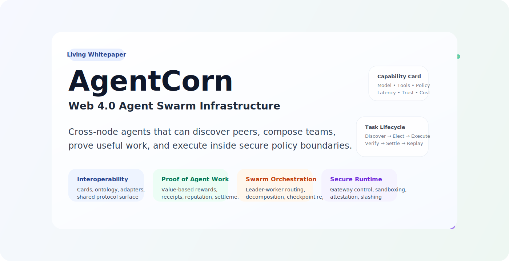
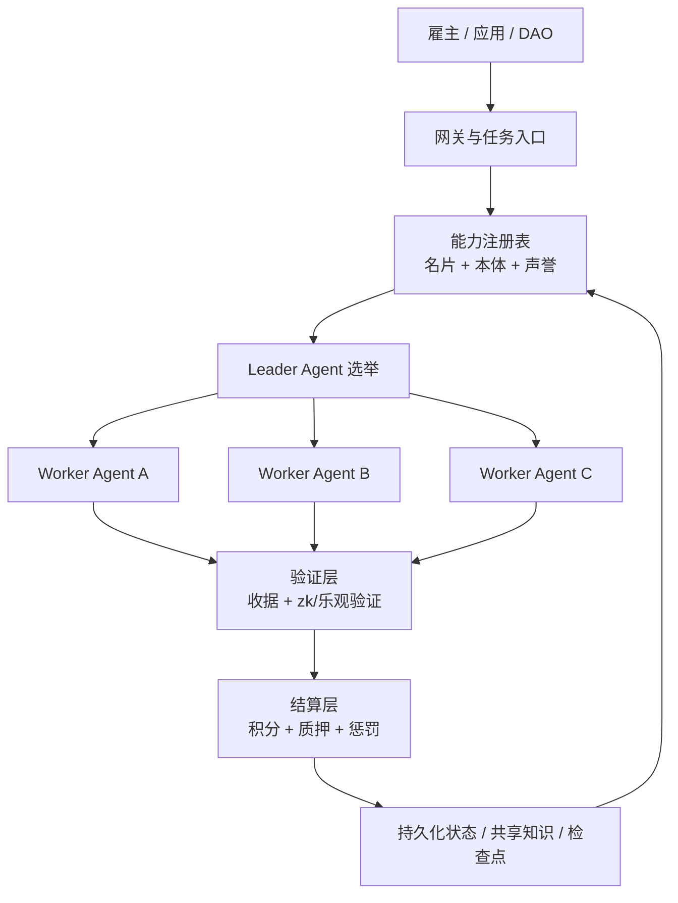

<p align="center">
  
</p>

<h1 align="center">AgentCoin</h1>

<p align="center">
  <strong>一个面向 Web 4.0 的去中心化智能体协作网络，用于跨节点协作、可验证工作量结算与安全执行。</strong>
</p>

<p align="center">
  <a href="README.md">English</a>
  ·
  <a href="README.zh-CN.md">简体中文</a>
  ·
  <a href="README.ja.md">日本語</a>
</p>

<p align="center">
  <a href="docs/whitepaper/zh-CN.md">阅读中文白皮书</a>
  ·
  <a href="docs/project/overview.md">项目文档</a>
  ·
  <a href="docs/testing/strategy.md">测试文档</a>
  ·
  <a href="docs/legal/gpl-notice.md">GPL 声明</a>
  ·
  <a href="docs/whitepaper/en.md">Read the English Whitepaper</a>
  ·
  <a href="docs/whitepaper/ja.md">日本語版を見る</a>
</p>

## 项目概览

AgentCoin 试图把分散在不同框架、不同组织和不同节点中的智能体，组织成一个可互操作、可组队、可验证、可结算的生产网络。它不是单一 Agent 框架，而是一层让异构 Agent 能互联协作的协议与运行基础设施。

项目采用四层架构：

- `互操作层`：能力名片、协议桥接、共享本体、标准化接口。
- `PoAW 共识与经济层`：围绕有用工作量而非无意义算力进行激励。
- `调度与协作层`：去中心化路由、Leader 选举、任务拆解与群体协作。
- `安全执行层`：网关代理、沙盒隔离、可信执行、声誉与惩罚。

## 核心价值

- 让不同技术栈的 Agent 以统一方式接入网络。
- 让任务不是“发给某个模型”，而是“发给一组可验证的协作节点”。
- 让结算依据结果质量、复杂度和可验证证据，而不是只看 Token 消耗。
- 让高权限 Agent 运行在受控环境，而不是直接暴露宿主机能力。

## 架构图



## 文档入口

| 语言 | 首页 | 白皮书 |
| --- | --- | --- |
| 简体中文 | [README.zh-CN.md](README.zh-CN.md) | [docs/whitepaper/zh-CN.md](docs/whitepaper/zh-CN.md) |
| English | [README.md](README.md) | [docs/whitepaper/en.md](docs/whitepaper/en.md) |
| 日本語 | [README.ja.md](README.ja.md) | [docs/whitepaper/ja.md](docs/whitepaper/ja.md) |

## 项目文档入口

- 项目说明：[docs/project/overview.md](docs/project/overview.md)
- 测试文档：[docs/testing/strategy.md](docs/testing/strategy.md)
- 架构说明：[docs/architecture/mvp.md](docs/architecture/mvp.md)
- Agent 适配策略：[docs/architecture/agent-adapters.md](docs/architecture/agent-adapters.md)
- OpenClaw 集成：[docs/integrations/openclaw.md](docs/integrations/openclaw.md)
- 链上路线图：[docs/architecture/onchain-roadmap.md](docs/architecture/onchain-roadmap.md)
- 蓝图偏差检查：[docs/architecture/alignment-gap.md](docs/architecture/alignment-gap.md)
- 通信说明：[docs/architecture/e2ee-connectivity.md](docs/architecture/e2ee-connectivity.md)
- 合约骨架：[contracts/README.md](contracts/README.md)
- GPL 声明：[docs/legal/gpl-notice.md](docs/legal/gpl-notice.md)
- 协议全文：[LICENSE](LICENSE)

## 当前阶段

当前仓库处于白皮书与架构定义阶段。下一步实现目标是做出一个最小可行网络，先完成节点注册、任务路由、状态持久化、工具调用验证和工作量结算这五个核心闭环。

## 参考实现

仓库现在已经包含一个零第三方依赖的 Python 参考节点，作为第一版可运行基线。

- `跨平台`：可在 macOS、Linux、Windows、WSL 上运行。
- `轻量化`：本地运行不依赖额外框架。
- `离线优先`：基于 SQLite 持久化任务、inbox、outbox。
- `默认安全`：默认仅绑定 `127.0.0.1`，写接口要求 Bearer Token。
- `签名传输`：capability card 和 task envelope 现在可以带 `HMAC` 签名，供 peer 验签。
- `非对称身份`：节点现在也可以用兼容 `ssh-keygen` 的 `Ed25519` 密钥为 card、任务和回执签名。
- `兼容多 Agent`：通过通用任务信封和能力名片接口接入不同 Agent。

仓库现在也加入了第一版面向 BNB Chain 的链上骨架：

- `AgentDIDRegistry`：链上智能体身份与基础信誉锚点
- `StakingPool`：原生 BNB 的质押、锁定、解锁与惩罚
- `BountyEscrow`：任务资金托管、接单、提交、完成、拒绝、退款与罚没流程

Python 参考节点现在也有了第一版链上接入骨架：

- 任务创建时可通过 `attach_onchain_context=true` 绑定 `spec_hash`、`job_id` 和合约引用
- `GET /v1/onchain/status` 可查看本地 BNB Chain 绑定状态
- `POST /v1/onchain/task-bind` 可为已有任务补充或更新链上 job 元数据
- 成功 ACK 的任务结果会自动附带签名 `_onchain_receipt`，包含 `submission_hash`、`result_hash`、`receipt_uri` 和预期链上动作
- `POST /v1/onchain/intents/build` 可生成带签名的 EVM 交易意图，覆盖 `createJob`、`acceptJob`、`submitWork`、`completeJob`、`rejectJob`、`slashJob`
- `POST /v1/onchain/rpc-payload` 可生成带签名的 JSON-RPC 载荷骨架，覆盖 `eth_sendTransaction`、`eth_estimateGas`、`eth_call`
- `POST /v1/onchain/rpc-plan` 可通过实时 JSON-RPC 预取 nonce、gas price 和 gas 估算，供外部 signer 或钱包继续签名广播
- `POST /v1/onchain/rpc/send-raw` 可把外部已签名的 raw transaction 转发到配置好的 RPC 节点

节点现在也有统一的出站网络层，适合弱网、VPN 和代理环境：

- peer sync、outbox 投递、worker API 调用以及后续链上 RPC 都能复用同一套 `http_proxy` / `https_proxy` 配置
- `no_proxy_hosts` 支持精确主机名、`.tailnet.internal` 这类后缀，以及 `100.64.0.0/10` 这类 CIDR
- loopback 流量始终直连，避免本地节点和本地 worker 被代理回环
- 这提升了 VPN 和企业代理兼容性，但不意味着保证绕过网络封锁

worker 运行时现在也有了第一版 Agent 适配层：

- `GET /v1/runtimes` 可列出内置 runtime adapter
- `POST /v1/runtimes/bind` 可把 runtime adapter 绑定到已有任务
- `http-json` 可通过同一套出站网络策略调用 HTTP Agent
- `openai-chat` 可调用 OpenAI 兼容网关，包括 OpenClaw Gateway
- `ollama-chat` 可直接调用本地 Ollama 兼容聊天接口，适合离线和私有部署
- `cli-json` 可通过 stdin/stdout JSON 调用本地 CLI Agent 包装器
- bridge adapter 和 runtime adapter 被刻意拆开，协议兼容不再强绑定执行方式

运行时现在也开始补最小语义层：

- `AgentCard` 和 `TaskEnvelope` 现在会带轻量级 JSON-LD 风格的 `semantics`
- `GET /v1/schema/context` 可返回共享上下文
- `GET /v1/schema/examples` 可返回 card 和 task 的语义示例
- 这仍然是轻量实现，但已经开始补齐最初蓝图里的 ontology gap

### 快速启动

```bash
python -m venv .venv
. .venv/bin/activate
pip install -e .
agentcoin-node --config configs/node.example.json
```

Windows PowerShell：

```powershell
python -m venv .venv
.venv\Scripts\Activate.ps1
pip install -e .
agentcoin-node --config configs/node.example.json
```

也可以直接使用：

```bash
docker compose up --build
```

自动化测试可以这样运行：

```bash
python -m unittest discover -s tests -v
```

GitHub Actions CI 现在会在 macOS、Linux、Windows 上运行语法检查和当前的 `unittest` 测试集。

当前这版节点已经能提供：

- `GET /healthz`
- `GET /v1/card`
- `GET /v1/schema/context`
- `GET /v1/schema/examples`
- `GET /v1/tasks`
- `GET /v1/tasks/dead-letter`
- `GET /v1/tasks/replay-inspect?task_id=...`
- `GET /v1/git/status`
- `GET /v1/git/diff`
- `GET /v1/workflows?workflow_id=...`
- `GET /v1/workflows/summary?workflow_id=...`
- `GET /v1/peers`
- `GET /v1/peer-cards`
- `GET /v1/audits`
- `GET /v1/onchain/status`
- `GET /v1/reputation`
- `GET /v1/violations`
- `GET /v1/quarantines`
- `GET /v1/governance-actions`
- `GET /v1/bridges`
- `GET /v1/runtimes`
- `GET /v1/outbox`
- `GET /v1/outbox/dead-letter`
- `POST /v1/tasks`
- `POST /v1/tasks/dispatch`
- `POST /v1/bridges/import`
- `POST /v1/bridges/export`
- `POST /v1/runtimes/bind`
- `POST /v1/integrations/openclaw/bind`
- `POST /v1/workflows/fanout`
- `POST /v1/workflows/review-gate`
- `POST /v1/workflows/merge`
- `POST /v1/workflows/finalize`
- `POST /v1/tasks/claim`
- `POST /v1/tasks/lease/renew`
- `POST /v1/tasks/ack`
- `POST /v1/inbox`
- `POST /v1/outbox/flush`
- `POST /v1/tasks/requeue`
- `POST /v1/outbox/requeue`
- `POST /v1/onchain/task-bind`
- `POST /v1/onchain/intents/build`
- `POST /v1/onchain/rpc-payload`
- `POST /v1/onchain/rpc-plan`
- `POST /v1/onchain/rpc/send-raw`
- `POST /v1/quarantines`
- `POST /v1/quarantines/release`
- `POST /v1/git/branch`
- `POST /v1/git/task-context`
- `POST /v1/peers/sync`

如果要通过加密覆盖网络把任务投递给配置好的节点，可以在提交任务时把 `deliver_to` 设置为 `configs/node.example.json` 里的 `peer_id`，例如 `agentcoin-peer-b`。

节点现在也可以主动拉取并缓存远端能力名片：

```bash
curl -X POST http://127.0.0.1:8080/v1/peers/sync -H "Authorization: Bearer change-me"
curl http://127.0.0.1:8080/v1/peer-cards
```

如果节点运行在 VPN、企业代理或 overlay 网关后面，可以直接配置 `configs/node.example.json` 里的 `network` 段。worker 侧现在也支持 `--http-proxy`、`--https-proxy`、`--no-proxy-host`、`--disable-env-proxy`。

本地任务队列现在也支持多 Agent 协调所需的租约锁：

- worker 用 `POST /v1/tasks/claim` 抢占任务
- 节点返回 `lease_token`
- worker 用 `POST /v1/tasks/lease/renew` 续租
- worker 用 `POST /v1/tasks/ack` 完成、失败或回队

这一步是后续做锁消息队列、任务队列和 swarm 调度的基础。

节点现在也开始适配真实 Git 仓库，而不是把内部 workflow 当成 Git 替代品：

- `GET /v1/git/status` 读取当前分支、HEAD、脏状态和改动文件
- `GET /v1/git/diff` 读取仓库 diff 或改动文件列表
- `POST /v1/git/branch` 从指定 ref 创建分支
- `POST /v1/git/task-context` 把真实仓库上下文绑定到已有任务
- `POST /v1/tasks` 现在可以传 `attach_git_context=true`，在创建时直接保存 `_git` 元数据

桥接层现在也有了第一版可执行骨架：

- `GET /v1/bridges` 可以列出当前启用的 bridge adapter
- `POST /v1/bridges/import` 可以把 `MCP` 或 `A2A` 风格消息导入成持久化 AgentCoin 任务
- `POST /v1/bridges/export` 可以把任务状态或结果重新导出成桥接协议消息
- bridge 上下文会保存在 `payload._bridge`，这样既保留外部协议语境，也不让内部任务模型被替代

worker 执行层现在也已经感知 bridge：

- worker 会识别 `payload._bridge.protocol`
- `MCP bridge task` 会产出规范化的 tool-call 风格结果
- `A2A bridge task` 会产出规范化的 message-result 结果
- 这仍然只是 adapter skeleton，不是完整的外部 `MCP/A2A runtime client`

执行层现在也有了第一版安全策略边界：

- worker 可以用 `--allow-tool` 定义 `MCP tool allowlist`
- worker 可以用 `--allow-intent` 定义 `A2A intent allowlist`
- `local-command` 默认禁用，只有加 `--allow-subprocess` 才能执行
- 子进程执行还必须通过 `--allow-command` 显式允许具体可执行文件
- `--workspace-root` 会限制子进程的工作目录，避免 bridge task 越界访问

现在也有了第一版执行审计和回放检查层：

- 每次任务 ACK 都会持久化一条 execution audit 事件
- `GET /v1/audits` 可以全局查看或按 `task_id` 过滤审计事件
- `GET /v1/tasks/replay-inspect?task_id=...` 会返回任务、审计轨迹和 bridge 导出预览
- `policy receipt` 和 `execution receipt` 现在会一起进入任务结果，方便后续复查和 replay

现在也有了第一版治理与隔离骨架：

- 策略拒绝的执行会被记录成 `policy_violations`
- worker 会从 `100` 分起算本地声誉分
- 重复违规会自动生成 quarantine 记录，并阻止该 worker id 继续 claim 新任务
- 运维和调度器可以通过 `GET /v1/reputation`、`GET /v1/violations`、`GET /v1/quarantines` 查看当前治理状态
- 运维也可以手动隔离或解除隔离某个 worker，并通过 `GET /v1/governance-actions` 查看治理动作历史
- 当节点启用了签名配置时，治理动作还会持久化带 `operator_id` 的 signed governance receipt

跨节点消息投递现在也加入了显式 ACK：

- inbox 按 `message_id` 做幂等去重
- 接收端返回 `ack`
- outbox 只有收到有效 ACK 才会标记为成功送达

参考节点现在也支持一版务实的签名身份校验：

- `GET /v1/card` 可以返回带 `HMAC` 签名的 capability card
- 配置了 `signing_secret` 后，发往远端的 task envelope 会自动签名
- 当 `require_signed_inbox=true` 时，inbox 可以强制要求合法 peer 签名
- `peer sync` 在缓存远端 capability card 之前会先校验签名

身份层现在也多了一条轻量非对称路径：

- 节点可以在 capability card 里公开 `identity_principal` 和公钥材料
- 如果配置了 `identity_private_key_path`，节点会用 `ssh-keygen -Y sign` 为 card、task envelope 和 delivery receipt 签名
- 可信 peer 可以用配置里的 `identity_principal` 和 `identity_public_key` 做验签
- 这样在不引入重依赖的前提下，已经不再只依赖共享密钥

现在也开始正式处理弱网和异常情况：

- outbox 会在 `pending -> retrying` 之间按指数退避重试
- 超过 `outbox_max_attempts` 后，消息进入 outbox dead-letter
- 如果 `local_dispatch_fallback=true` 且本地能力满足，远端派发失败会回退成 `fallback-local`
- 否则任务本身会进入 task dead-letter，等待人工回放或治理处理

任务重试现在也有明确边界：

- 每个任务带有 `max_attempts`、`retry_backoff_seconds`、`available_at`、`last_error`
- `POST /v1/tasks/ack` 传 `requeue=true` 时不会立刻再次 claim，而是延迟重试
- 超过重试上限后，任务自动进入 `dead-letter`
- 运维方可以通过 `POST /v1/tasks/requeue` 和 `POST /v1/outbox/requeue` 重新放回队列

现在也已经有了最小版 planner 分发：

- `POST /v1/tasks/dispatch`
- 根据 `required_capabilities` 结合缓存的 peer card 自动选目标
- 如果没有匹配 peer，但本地能力满足，则任务留在本地

仓库也带了一个最小 worker pull loop：

```bash
agentcoin-worker \
  --node-url http://127.0.0.1:8080 \
  --token change-me \
  --worker-id worker-1 \
  --capability worker
```

如果要跑带受限本地命令沙箱的 bridge-aware worker，可以这样：

```bash
agentcoin-worker \
  --node-url http://127.0.0.1:8080 \
  --token change-me \
  --worker-id worker-bridge \
  --capability worker \
  --capability local-command \
  --allow-tool local-command \
  --allow-subprocess \
  --allow-command python \
  --workspace-root .
```

任务现在也具备 Git-like 特性：

- `workflow_id`
- `parent_task_id`
- `branch`
- `revision`
- `merge_parent_ids`
- `commit_message`
- `depends_on`

这意味着 AgentCoin 里的任务不再只是平铺队列，而是可以形成带分支和依赖的任务 DAG。

现在工作流也已经支持“汇合”和“封板”：

- `POST /v1/workflows/review-gate` 可以创建显式 reviewer 任务，对目标分支任务进行审批
- `POST /v1/workflows/merge` 可以生成依赖多个分支任务的 merge / aggregate / reviewer 任务
- `GET /v1/workflows/summary?workflow_id=...` 可以查看分支、角色、状态、ready、blocked、leaf task 等摘要
- `POST /v1/workflows/finalize` 会在所有开放任务结束后，把终态工作流摘要持久化
- planner 在执行 `fanout` 后会自动完成父任务，避免根任务永远停在 `queued`

现在也已经有了 protected merge：

- merge 任务可以声明 `protected_branches`
- 每个受保护分支在 merge 放行前都可以要求 reviewer 审批
- workflow summary 现在会暴露 `review_task_ids`、`review_approvals`、`merge_gate_status`
- 审批策略现在可以区分 `human reviewer` 和 `AI reviewer`
- merge 策略现在可以分别要求每个受保护分支的人类审批数和 AI 审批数

## 通信方向

当前推荐的“无公网 IP 多 Agent 端到端加密通信”方案是：

- `Headscale` 作为自托管控制平面
- 每个节点运行 `Tailscale 兼容客户端`
- 使用 `DERP` 作为复杂 NAT 下的中继回退
- AgentCoin 自身协议继续跑在加密覆盖网络地址之上

详见 [docs/architecture/e2ee-connectivity.md](docs/architecture/e2ee-connectivity.md)。

## 测试状态

当前仓库已经带有自动化 `unittest` 测试和跨平台 GitHub Actions CI，覆盖了任务重试、死信、消息 ACK、`HMAC/SSH` 验签、`MCP/A2A bridge`、工作流 merge/finalize 和弱网 fallback 等核心路径。

## 开源协议

本仓库采用 GNU General Public License v3.0 或更高版本。详见 [LICENSE](LICENSE) 和 [docs/legal/gpl-notice.md](docs/legal/gpl-notice.md)。
