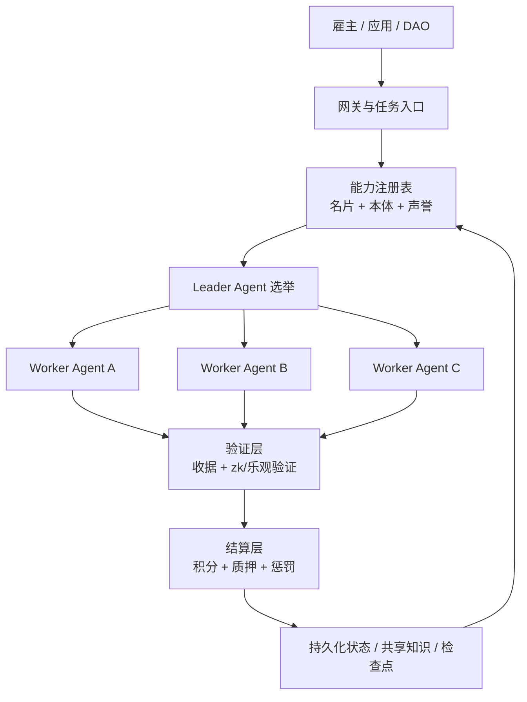

<p align="center">
  
</p>

<h1 align="center">AgentCoin</h1>

<p align="center">
  <strong>一个面向 Web 4.0 的去中心化智能体协作网络，用于跨节点协作、可验证工作量结算与安全执行。</strong>
</p>

<p align="center">
  <a href="README.md">English</a>
  ·
  <a href="README.zh-CN.md">简体中文</a>
  ·
  <a href="README.ja.md">日本語</a>
</p>

<p align="center">
  <a href="docs/whitepaper/zh-CN.md">阅读中文白皮书</a>
  ·
  <a href="docs/project/overview.md">项目文档</a>
  ·
  <a href="docs/testing/strategy.md">测试文档</a>
  ·
  <a href="docs/legal/gpl-notice.md">GPL 声明</a>
  ·
  <a href="docs/whitepaper/en.md">Read the English Whitepaper</a>
  ·
  <a href="docs/whitepaper/ja.md">日本語版を見る</a>
</p>

## 项目概览

AgentCoin 试图把分散在不同框架、不同组织和不同节点中的智能体，组织成一个可互操作、可组队、可验证、可结算的生产网络。它不是单一 Agent 框架，而是一层让异构 Agent 能互联协作的协议与运行基础设施。

项目采用四层架构：

- `互操作层`：能力名片、协议桥接、共享本体、标准化接口。
- `PoAW 共识与经济层`：围绕有用工作量而非无意义算力进行激励。
- `调度与协作层`：去中心化路由、Leader 选举、任务拆解与群体协作。
- `安全执行层`：网关代理、沙盒隔离、可信执行、声誉与惩罚。

## 核心价值

- 让不同技术栈的 Agent 以统一方式接入网络。
- 让任务不是“发给某个模型”，而是“发给一组可验证的协作节点”。
- 让结算依据结果质量、复杂度和可验证证据，而不是只看 Token 消耗。
- 让高权限 Agent 运行在受控环境，而不是直接暴露宿主机能力。

## 架构图



## 文档入口

| 语言 | 首页 | 白皮书 |
| --- | --- | --- |
| 简体中文 | [README.zh-CN.md](README.zh-CN.md) | [docs/whitepaper/zh-CN.md](docs/whitepaper/zh-CN.md) |
| English | [README.md](README.md) | [docs/whitepaper/en.md](docs/whitepaper/en.md) |
| 日本語 | [README.ja.md](README.ja.md) | [docs/whitepaper/ja.md](docs/whitepaper/ja.md) |

## 项目文档入口

- 项目说明：[docs/project/overview.md](docs/project/overview.md)
- 测试文档：[docs/testing/strategy.md](docs/testing/strategy.md)
- 架构说明：[docs/architecture/mvp.md](docs/architecture/mvp.md)
- 通信说明：[docs/architecture/e2ee-connectivity.md](docs/architecture/e2ee-connectivity.md)
- GPL 声明：[docs/legal/gpl-notice.md](docs/legal/gpl-notice.md)
- 协议全文：[LICENSE](LICENSE)

## 当前阶段

当前仓库处于白皮书与架构定义阶段。下一步实现目标是做出一个最小可行网络，先完成节点注册、任务路由、状态持久化、工具调用验证和工作量结算这五个核心闭环。

## 参考实现

仓库现在已经包含一个零第三方依赖的 Python 参考节点，作为第一版可运行基线。

- `跨平台`：可在 macOS、Linux、Windows、WSL 上运行。
- `轻量化`：本地运行不依赖额外框架。
- `离线优先`：基于 SQLite 持久化任务、inbox、outbox。
- `默认安全`：默认仅绑定 `127.0.0.1`，写接口要求 Bearer Token。
- `兼容多 Agent`：通过通用任务信封和能力名片接口接入不同 Agent。

### 快速启动

```bash
python -m venv .venv
. .venv/bin/activate
pip install -e .
agentcoin-node --config configs/node.example.json
```

Windows PowerShell：

```powershell
python -m venv .venv
.venv\Scripts\Activate.ps1
pip install -e .
agentcoin-node --config configs/node.example.json
```

也可以直接使用：

```bash
docker compose up --build
```

自动化测试可以这样运行：

```bash
python -m unittest discover -s tests -v
```

GitHub Actions CI 现在会在 macOS、Linux、Windows 上运行语法检查和当前的 `unittest` 测试集。

当前这版节点已经能提供：

- `GET /healthz`
- `GET /v1/card`
- `GET /v1/tasks`
- `GET /v1/tasks/dead-letter`
- `GET /v1/workflows?workflow_id=...`
- `GET /v1/workflows/summary?workflow_id=...`
- `GET /v1/peers`
- `GET /v1/peer-cards`
- `GET /v1/outbox`
- `GET /v1/outbox/dead-letter`
- `POST /v1/tasks`
- `POST /v1/tasks/dispatch`
- `POST /v1/workflows/fanout`
- `POST /v1/workflows/merge`
- `POST /v1/workflows/finalize`
- `POST /v1/tasks/claim`
- `POST /v1/tasks/lease/renew`
- `POST /v1/tasks/ack`
- `POST /v1/inbox`
- `POST /v1/outbox/flush`
- `POST /v1/tasks/requeue`
- `POST /v1/outbox/requeue`
- `POST /v1/peers/sync`

如果要通过加密覆盖网络把任务投递给配置好的节点，可以在提交任务时把 `deliver_to` 设置为 `configs/node.example.json` 里的 `peer_id`，例如 `agentcoin-peer-b`。

节点现在也可以主动拉取并缓存远端能力名片：

```bash
curl -X POST http://127.0.0.1:8080/v1/peers/sync -H "Authorization: Bearer change-me"
curl http://127.0.0.1:8080/v1/peer-cards
```

本地任务队列现在也支持多 Agent 协调所需的租约锁：

- worker 用 `POST /v1/tasks/claim` 抢占任务
- 节点返回 `lease_token`
- worker 用 `POST /v1/tasks/lease/renew` 续租
- worker 用 `POST /v1/tasks/ack` 完成、失败或回队

这一步是后续做锁消息队列、任务队列和 swarm 调度的基础。

跨节点消息投递现在也加入了显式 ACK：

- inbox 按 `message_id` 做幂等去重
- 接收端返回 `ack`
- outbox 只有收到有效 ACK 才会标记为成功送达

现在也开始正式处理弱网和异常情况：

- outbox 会在 `pending -> retrying` 之间按指数退避重试
- 超过 `outbox_max_attempts` 后，消息进入 outbox dead-letter
- 如果 `local_dispatch_fallback=true` 且本地能力满足，远端派发失败会回退成 `fallback-local`
- 否则任务本身会进入 task dead-letter，等待人工回放或治理处理

任务重试现在也有明确边界：

- 每个任务带有 `max_attempts`、`retry_backoff_seconds`、`available_at`、`last_error`
- `POST /v1/tasks/ack` 传 `requeue=true` 时不会立刻再次 claim，而是延迟重试
- 超过重试上限后，任务自动进入 `dead-letter`
- 运维方可以通过 `POST /v1/tasks/requeue` 和 `POST /v1/outbox/requeue` 重新放回队列

现在也已经有了最小版 planner 分发：

- `POST /v1/tasks/dispatch`
- 根据 `required_capabilities` 结合缓存的 peer card 自动选目标
- 如果没有匹配 peer，但本地能力满足，则任务留在本地

仓库也带了一个最小 worker pull loop：

```bash
agentcoin-worker \
  --node-url http://127.0.0.1:8080 \
  --token change-me \
  --worker-id worker-1 \
  --capability worker
```

任务现在也具备 Git-like 特性：

- `workflow_id`
- `parent_task_id`
- `branch`
- `revision`
- `merge_parent_ids`
- `commit_message`
- `depends_on`

这意味着 AgentCoin 里的任务不再只是平铺队列，而是可以形成带分支和依赖的任务 DAG。

现在工作流也已经支持“汇合”和“封板”：

- `POST /v1/workflows/merge` 可以生成依赖多个分支任务的 merge / aggregate / reviewer 任务
- `GET /v1/workflows/summary?workflow_id=...` 可以查看分支、角色、状态、ready、blocked、leaf task 等摘要
- `POST /v1/workflows/finalize` 会在所有开放任务结束后，把终态工作流摘要持久化
- planner 在执行 `fanout` 后会自动完成父任务，避免根任务永远停在 `queued`

## 通信方向

当前推荐的“无公网 IP 多 Agent 端到端加密通信”方案是：

- `Headscale` 作为自托管控制平面
- 每个节点运行 `Tailscale 兼容客户端`
- 使用 `DERP` 作为复杂 NAT 下的中继回退
- AgentCoin 自身协议继续跑在加密覆盖网络地址之上

详见 [docs/architecture/e2ee-connectivity.md](docs/architecture/e2ee-connectivity.md)。

## 测试状态

当前仓库已经带有自动化 `unittest` 测试和跨平台 GitHub Actions CI，覆盖了任务重试、死信、消息 ACK、工作流 merge/finalize 和弱网 fallback 等核心路径。

## 开源协议

本仓库采用 GNU General Public License v3.0 或更高版本。详见 [LICENSE](LICENSE) 和 [docs/legal/gpl-notice.md](docs/legal/gpl-notice.md)。
