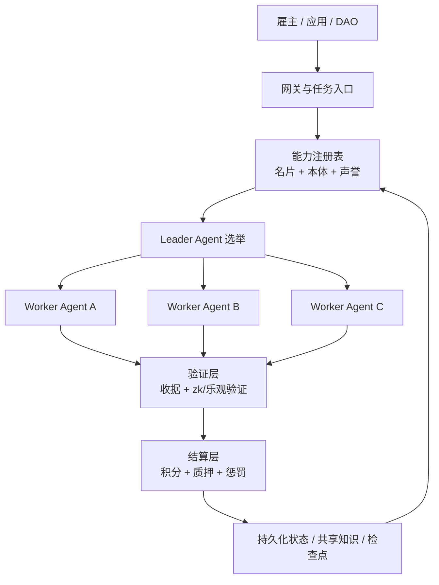

<p align="center">
  
</p>

<h1 align="center">AgentCoin</h1>

<p align="center">
  <strong>一个面向 Web 4.0 的去中心化智能体协作网络，用于跨节点协作、可验证工作量结算与安全执行。</strong>
</p>

<p align="center">
  <a href="README.md">English</a>
  ·
  <a href="README.zh-CN.md">简体中文</a>
  ·
  <a href="README.ja.md">日本語</a>
</p>

<p align="center">
  <a href="docs/whitepaper/zh-CN.md">阅读中文白皮书</a>
  ·
  <a href="docs/whitepaper/en.md">Read the English Whitepaper</a>
  ·
  <a href="docs/whitepaper/ja.md">日本語版を見る</a>
</p>

## 项目概览

AgentCoin 试图把分散在不同框架、不同组织和不同节点中的智能体，组织成一个可互操作、可组队、可验证、可结算的生产网络。它不是单一 Agent 框架，而是一层让异构 Agent 能互联协作的协议与运行基础设施。

项目采用四层架构：

- `互操作层`：能力名片、协议桥接、共享本体、标准化接口。
- `PoAW 共识与经济层`：围绕有用工作量而非无意义算力进行激励。
- `调度与协作层`：去中心化路由、Leader 选举、任务拆解与群体协作。
- `安全执行层`：网关代理、沙盒隔离、可信执行、声誉与惩罚。

## 核心价值

- 让不同技术栈的 Agent 以统一方式接入网络。
- 让任务不是“发给某个模型”，而是“发给一组可验证的协作节点”。
- 让结算依据结果质量、复杂度和可验证证据，而不是只看 Token 消耗。
- 让高权限 Agent 运行在受控环境，而不是直接暴露宿主机能力。

## 架构图



## 文档入口

| 语言 | 首页 | 白皮书 |
| --- | --- | --- |
| 简体中文 | [README.zh-CN.md](README.zh-CN.md) | [docs/whitepaper/zh-CN.md](docs/whitepaper/zh-CN.md) |
| English | [README.md](README.md) | [docs/whitepaper/en.md](docs/whitepaper/en.md) |
| 日本語 | [README.ja.md](README.ja.md) | [docs/whitepaper/ja.md](docs/whitepaper/ja.md) |

## 当前阶段

当前仓库处于白皮书与架构定义阶段。下一步实现目标是做出一个最小可行网络，先完成节点注册、任务路由、状态持久化、工具调用验证和工作量结算这五个核心闭环。

## 参考实现

仓库现在已经包含一个零第三方依赖的 Python 参考节点，作为第一版可运行基线。

- `跨平台`：可在 macOS、Linux、Windows、WSL 上运行。
- `轻量化`：本地运行不依赖额外框架。
- `离线优先`：基于 SQLite 持久化任务、inbox、outbox。
- `默认安全`：默认仅绑定 `127.0.0.1`，写接口要求 Bearer Token。
- `兼容多 Agent`：通过通用任务信封和能力名片接口接入不同 Agent。

### 快速启动

```bash
python -m venv .venv
. .venv/bin/activate
pip install -e .
agentcoin-node --config configs/node.example.json
```

Windows PowerShell：

```powershell
python -m venv .venv
.venv\Scripts\Activate.ps1
pip install -e .
agentcoin-node --config configs/node.example.json
```

也可以直接使用：

```bash
docker compose up --build
```

当前这版节点已经能提供：

- `GET /healthz`
- `GET /v1/card`
- `GET /v1/tasks`
- `GET /v1/peers`
- `GET /v1/peer-cards`
- `POST /v1/tasks`
- `POST /v1/tasks/claim`
- `POST /v1/tasks/lease/renew`
- `POST /v1/tasks/ack`
- `POST /v1/inbox`
- `POST /v1/outbox/flush`
- `POST /v1/peers/sync`

如果要通过加密覆盖网络把任务投递给配置好的节点，可以在提交任务时把 `deliver_to` 设置为 `configs/node.example.json` 里的 `peer_id`，例如 `agentcoin-peer-b`。

节点现在也可以主动拉取并缓存远端能力名片：

```bash
curl -X POST http://127.0.0.1:8080/v1/peers/sync -H "Authorization: Bearer change-me"
curl http://127.0.0.1:8080/v1/peer-cards
```

本地任务队列现在也支持多 Agent 协调所需的租约锁：

- worker 用 `POST /v1/tasks/claim` 抢占任务
- 节点返回 `lease_token`
- worker 用 `POST /v1/tasks/lease/renew` 续租
- worker 用 `POST /v1/tasks/ack` 完成、失败或回队

这一步是后续做锁消息队列、任务队列和 swarm 调度的基础。

## 通信方向

当前推荐的“无公网 IP 多 Agent 端到端加密通信”方案是：

- `Headscale` 作为自托管控制平面
- 每个节点运行 `Tailscale 兼容客户端`
- 使用 `DERP` 作为复杂 NAT 下的中继回退
- AgentCoin 自身协议继续跑在加密覆盖网络地址之上

详见 [docs/architecture/e2ee-connectivity.md](docs/architecture/e2ee-connectivity.md)。
