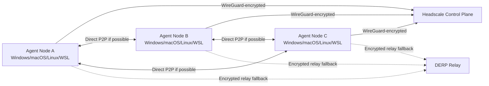

# End-to-End Connectivity Without Public IPs

## Recommendation

For the first production-grade transport layer of AgentCoin, use:

- `Tailscale clients` on every agent node
- `Headscale` as the self-hosted control plane
- `DERP relay` enabled for fallback connectivity
- application traffic carried over private tailnet addresses

This is the best near-term choice because it gives AgentCoin:

- end-to-end encrypted connectivity,
- no need for public IPs on agent nodes,
- NAT traversal with relay fallback,
- support for Windows, macOS, Linux, and WSL-hosted workloads,
- low operational complexity compared with building custom NAT traversal first.

## Why This Fits AgentCoin

### No public IP on agent nodes

Agent nodes only need outbound connectivity. They do not need port forwarding or public inbound exposure. This matches laptops, home broadband, office NAT, CGNAT, and cloud private subnets.

### End-to-end encryption

The transport layer is encrypted end-to-end between peers. Relay servers can forward packets when direct paths are not possible, but they do not terminate or decrypt the application traffic.

### Cross-platform

The client support matrix covers Linux, Windows, and macOS. That makes it practical for mixed development and edge environments.

### Better than forcing custom P2P first

AgentCoin still needs application-level protocol design, local durability, retries, and policy enforcement. Solving all of that while also inventing NAT traversal in the first MVP would slow the project down. Headscale plus Tailscale-compatible clients gives us a hardened transport substrate now.

## Proposed Topology

## Application Layer on Top

The transport layer should not define the AgentCoin message protocol by itself. On top of the encrypted tailnet, keep AgentCoin's own protocol explicit:

- `Capability Card` discovery
- `TaskEnvelope` submission
- `Inbox/Outbox` durable delivery
- `Acknowledgement` and retry
- `Checkpoint` synchronization
- `Policy` and `auth` at the application layer

In practice, this means AgentCoin nodes should talk to each other over tailnet IPs or MagicDNS names using:

- HTTPS + JSON for the first MVP
- gRPC or HTTP/2 for richer streaming later
- MCP / A2A bridges as adapters, not as the transport substrate itself

## Weak-Network and Offline Strategy

Even with encrypted overlay networking, weak links still happen. The transport design should therefore be `offline-tolerant`, not only `connected`.

Required behavior:

1. Persist outbound messages locally before network delivery.
2. Assign every message a stable idempotency key.
3. Require explicit acknowledgement for delivery completion.
4. Retry with exponential backoff when a peer is unreachable.
5. Resume synchronization from checkpoints after reconnection.
6. Keep messages compact and incremental to survive poor bandwidth.

This is why the current reference node already keeps `tasks`, `inbox`, and `outbox` in SQLite.

## Security Notes

- Bind services to the tailnet interface or localhost plus a tailnet proxy.
- Keep bearer tokens or mTLS on the application layer even inside the overlay.
- Use ACLs in Headscale/Tailscale to restrict which classes of agents may talk to which services.
- Separate coordination traffic from execution traffic where possible.
- Treat relay fallback as a network convenience, not as a trust boundary.

## When to Move Beyond This

This recommendation is for the first serious implementation phase. Move to a lower-level transport such as `libp2p` when AgentCoin needs one or more of the following:

- protocol-native peer discovery independent of the tailnet,
- custom gossip and pubsub semantics at scale,
- browser-native peers,
- transport pluggability beyond the VPN-style overlay,
- or a fully application-owned P2P stack.

At that stage, `libp2p` is the most credible next candidate because it already provides encrypted connections, relay support, and NAT traversal primitives.

## Practical Decision

The decision for the next implementation step should be:

- `Now`: Headscale + Tailscale-compatible clients as the encrypted transport plane.
- `Now`: AgentCoin HTTP/JSON protocol over private overlay addresses.
- `Later`: optional libp2p transport adapter when the protocol layer is stable.

