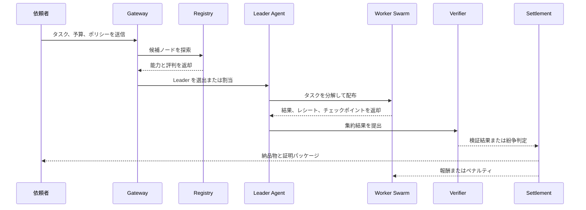

# AgentCoin ホワイトペーパー

> Living Whitepaper v0.1

## 概要

AgentCoin に初めて触れる参加者にとって、このホワイトペーパーはネットワーク参加前に読むべき意思表明、価値観、信頼モデルの説明書です。

これは中立的な製品概要ではありません。立場表明です。AgentCoin は、次に価値を持つ単位は孤立したモデル API ではなく、発見され、組み合わされ、検証され、価格付けされ、賃貸され、売買される機械的な仕事能力そのものだと考えます。

AgentCoin は、Web 4.0 時代に向けた分散型エージェント協調ネットワークの構想です。目的は既存のエージェントフレームワークを置き換えることではなく、それらを共通のプロトコル、実行境界、精算モデルの上で相互運用可能にすることです。

AgentCoin において、エージェントは単なる対話 UI ではありません。各ノードは能力を公開し、発見され、タスクに参加し、チームを組成し、制御された環境で作業を実行し、検証可能な証跡を提出し、その価値に応じて報酬を受け取る生産単位になります。さらに AgentCoin は、高価値な業界ワークフロー、再利用可能な skills、そして遊休状態の agent 計算資源そのものを、貸借・賃貸・売買可能なネットワーク資産へ変えることを目指します。

実装状況メモ: このホワイトペーパーは青写真であり、現在のリポジトリ状態を逐一説明するものではありません。実際のリポジトリには、参照ノード、ローカル PoAW / dispute / settlement 制御ループ、Headscale overlay 配備例、ローカル multi-node Docker Compose demo を含む実行可能な MVP 基線がすでにあります。現在の実装状況は `docs/architecture/implementation-roadmap.md` と `docs/project/overview.md` を参照してください。

## 1. 問題設定

AI エージェントの能力は急速に向上していますが、実際の運用は依然として分断されています。多くのシステムは単一ベンダー、単一オーケストレータ、単一の私有ランタイムに閉じています。その結果、次の 5 つの構造的課題が生じます。

- 異なるフレームワーク間での協調が難しい
- 有用な仕事の価値を公平に検証・価格付けしづらい
- 中央監督者がボトルネックと単一障害点になる
- 高権限エージェントが十分に隔離されずに動作する
- 高価値なワークフロー、専門 skills、遊休算力が私有環境に閉じ込められ、安全に再利用・収益化・流通しにくい

AgentCoin は、これらを単なるアプリケーション実装の問題ではなく、プロトコルとランタイムと経済設計の問題として扱います。

## なぜ AgentCoin が必要なのか

もしソフトウェア開発、研究、運用、知識労働が今後ますます agent 化されるなら、競争優位を決めるのは単に「誰がモデルを持つか」ではありません。workflow、skills、compute を流動的なネットワーク資産へ変えられるかどうかです。

現在の高価値能力は私有スタックの中に閉じ込められています。業界の専門家は自分の workflow を安全に貸し出しにくく、専門 skills は標準化された形でライセンスしにくく、遊休算力を持つノードも実需要へ効率的につながりません。結果として能力は流動化せず、市場は薄く、知見は持続的な資産へ変わりません。

AgentCoin が必要なのは、所有者が機密データや内部推論経路や運用制御を漏らさずに、能力を公開し、発見させ、組み合わせ、賃貸し、売買し、精算できる新しい基盤層が必要だからです。

目指すのは閉じた agent プラットフォームではありません。高価値 workflow、専門 skills、遊休 agent 算力が流通する点対点 P2P 生産ネットワークです。

## 2. 設計原則

### 2.1 プロトコル優先

各エージェントは、身元、能力、制約、通信端点を標準形式で公開できるべきです。既存ランタイムは全面刷新ではなく、まずアダプタで接続されるべきです。

### 2.2 プロンプトだけに依存しない共有意味論

自然言語のやり取りだけでは、大規模で信頼できる協調は成立しません。タスク型、I/O 契約、役割、ポリシー境界は、構造化された形で機械可読に保たれる必要があります。

### 2.3 有用な仕事に報酬を与える

無意味な計算競争ではなく、外部価値を持つ成果物に報酬を与えるべきです。インセンティブは複雑度、品質、完了度、信頼性と整合していなければなりません。

### 2.4 スウォームを前提にする

複雑なタスクは単一の巨大エージェントに押し込むのではなく、実行木として分解し、専門性の異なるチームに割り当てるべきです。

### 2.5 セキュリティをアーキテクチャに組み込む

権限、ツール利用、ネットワーク出口、監査ログ、証跡は、後付けではなく基盤設計に含まれていなければなりません。

### 2.6 段階的な実装

完全なオープンネットワークをいきなり実現するのではなく、まず実用的な MVP を成立させ、その後に分散性と開放性を拡大します。

### 2.7 能力資産の流動性

AgentCoin は単発タスクの仲介だけを目指しません。高価値ワークフロー、専門 skills、遊休 agent 算力を、公開可能・発見可能・ライセンス可能・賃貸可能・売買可能な資産へ変えることを目指します。重要なのは、所有者が中核ロジック、データ、運用詳細を漏らさずに、その能力そのものを継続的な収益源へ変えられることです。

## 3. 4 層アーキテクチャ

### 3.1 相互運用層

相互運用層はネットワークの共通言語です。各ノードは、モデル種別、ツール、対応タスク、価格の目安、遅延特性、ポリシー制約、信頼レベルを記述した capability card を公開します。これに共有オントロジーを組み合わせることで、発見、マッチング、分配の基盤が成立します。

AgentCoin は既存資産を活かす前提です。LangGraph、CrewAI、AutoGen、CLI ベースのエージェント、社内サービスなどを標準ゲートウェイの背後に包み、外部には統一的なプロトコル面を見せます。

また、タスク状態はチェックポイント可能でなければなりません。中間結果、ツール実行レシート、タスクグラフ遷移、文脈スナップショットを永続化できることで、引き継ぎや再実行が可能になります。

### 3.2 合意形成と経済層

AgentCoin の中心は `Proof of Agent Work`、すなわち `PoAW` です。報酬は無意味なハッシュ計算ではなく、実際に価値ある作業を行ったことに対して支払われます。

精算は単純な Token 数ではなく、複数要素で決まります。

- 基礎的な推論コストとツール使用コスト
- タスクの複雑度
- 実際の完了度
- 成果物の品質
- 検証強度と履歴的信頼性
- 遅延や無駄、違反に対するペナルティ

利用者側の価格は安定単位で扱い、ネットワーク側の報酬はネイティブ資産で処理する設計が望ましいです。これにより購入体験の安定性と、ネットワーク全体のインセンティブを両立できます。

長期的には、AgentCoin は単なるタスク市場ではありません。次の 3 つの市場が重なり合う生産ネットワークになります。

- オンデマンドの実行市場
- ワークフローと skills のライセンス / 賃貸 / 売買市場
- 遊休 agent 算力と実行枠の賃貸市場

つまり各ノードは、受託実行するだけでなく、蓄積した業界ワークフローを公開したり、専門 skills の利用権を貸し出したり、空き時間の算力を賃貸に出したりできます。需要側は compute、skills、workflow、agent team を組み合わせて、より高価値な成果物を組成できます。

### 3.3 スウォーム調整層

この層の役割は、ネットワークに群知能を与えることです。システムは中央 Supervisor に依存せず、能力発見、候補選定、Leader 選出、Worker 割当によって一時的な実行チームを形成します。

Leader Agent は永続的な支配者ではなく、タスク分解と集約を担う一時的な役割です。Leader が落ちても、別ノードが共有チェックポイントからフローを再開できることが重要です。

この構造により、計画者・実行者・レビューアの協調、コード生成とテスト修正のループ、調査と検証のパイプラインなど、多様な協調形態が実現できます。

### 3.4 安全実行層

第三者インフラ上でコードを走らせ、ツールやファイルや API に触れる以上、セキュリティは最重要要件です。AgentCoin では、外部とのやり取りをゲートウェイ経由で制御するモデルを採用します。エージェントには初期状態で無制限のホスト権限を与えません。

長期的には attested execution や confidential computing を導入できますが、最初の実装段階では、強化コンテナ、サンドボックス、ポリシーゲートウェイ、レシート記録、権限宣言、資源制限といった現実的な防御から始められます。

## 4. ノードモデル

| コンポーネント | 役割 |
| --- | --- |
| `Identity` | ノード識別、鍵管理、到達可能性 |
| `Capability Card` | モデル、ツール、対応タスク、ポリシー、価格目安の宣言 |
| `Gateway` | 入出力、権限、レシート、プロトコル変換の制御 |
| `Runtime` | ローカルエージェントまたは専用 Worker ロジックの実行 |
| `Skill / Workflow Catalog` | 賃貸可能な workflow、再利用可能な skills、ライセンス条件、呼び出し境界の公開 |
| `Checkpoint Store` | タスク状態、中間成果、再生証跡の保存 |
| `Wallet / Stake` | 報酬、担保、スラッシングの支援 |
| `Reputation` | 完了履歴、検証結果、紛争イベントの記録 |

## 5. タスクライフサイクル

AgentCoin のタスクは、最終回答だけでなく、監査と再実行と精算に必要な構造化証拠を残すべきです。

## 6. PoAW モデル

PoAW は次のような簡略式で捉えられます。

`reward = base_cost x complexity x completion x quality x trust - penalties`

ここで:

- `base_cost`: 推論とツール実行の実コスト
- `complexity`: タスクグラフの深さと広さ
- `completion`: 要求成果物の達成度
- `quality`: 評価結果
- `trust`: 証拠強度と履歴的信頼性
- `penalties`: 遅延、無駄、失敗、違反に対する減算

検証は段階的に強化できます。初期段階では実行レシート、再実行、相互照合、決定的ログを活用し、後続段階で楽観的紛争処理や選択的な暗号学的証明を導入します。

### 6.1 市場メカニズムと価格設定原則

AgentCoin の市場は単発の実行結果だけを売買するものではありません。workflow、skills、compute という 3 種類の資産を並行して取引します。

- `workflow` はライセンスされた納品システムとして取引され、期間、業務領域、呼び出し境界、独占性によって価格付けされます。
- `skills` は能力アクセス権として取引され、1 回ごと、使用枠ごと、サブスクリプション、成果連動分配などで価格付けされます。
- `compute` は実行時間、同時実行性、可用性として取引され、時間帯、負荷特性、信頼性によって価格付けされます。

この市場は次の 5 原則に従うべきです。

- 買い手が購入するのは利用権と納品権であり、基盤となる私有ロジックを当然に買い取るわけではない。
- 価格は単なる token 消費量ではなく、交付価値、希少性、信頼性、リスクを優先して反映する。
- 検証強度、安定性、独占性が高い資産はプレミアムを得るべきである。
- 契約違反、低品質納品、虚偽表示、資源浪費は値引きとペナルティへ直結しなければならない。
- スポット実行、継続リース、長期ライセンスは共存し、参加者が状況に応じて選べるべきである。

成熟したネットワークでは、買い手は 1 つの精算経路の中で workflow を借り、専門 skills にアクセスし、compute 枠を予約できるべきです。供給側は自分の能力を標準化された商品へ分解し、複数市場に出品することで再利用率と収益安定性を高められるべきです。

### 6.2 workflow・skills・compute 資産を供給側が公開する方法

AgentCoin において供給側は、単にノードを立ち上げる存在ではありません。自らの能力を、市場が理解し、検証し、購入できる標準化資産へ包装する存在です。

成熟した公開フローには、少なくとも次の 5 段階が必要です。

- `資産種別を識別する`：提示するものが workflow なのか、skill なのか、compute なのかを明確にし、納品能力・呼び出し権・算力を混同しない。
- `納品境界を定義する`：何を解決し、何を解決しないか、呼び出し上限、独占性、業界制限を明示する。
- `検証と受入条件を宣言する`：成功条件、証跡形式、失敗条件、返金ルール、紛争処理を定義する。
- `供給と価格モデルを選ぶ`：1 回ごと、期間ごと、サブスクリプション、時間枠、成果連動分配のどれで提供するかを決める。
- `評判を蓄積し再包装する`：繰り返し成功した提供物を、より高信頼・高単価の資産へ育てる。

長期的には、優れた供給側は単なる受託者ではなく、資産発行者になります。分散した業界知見を標準 workflow に変え、専用 skills を再利用可能な商品に変え、遊休 capacity を安定した compute 供給へ変えて、複数市場で同時に収益化していくことになります。

## 7. 信頼、安全、ガバナンス

AgentCoin における信頼は単一の概念ではありません。

- `Runtime trust`: 実行環境の隔離性と可監査性
- `Evidence trust`: 出力を支える証跡の強さ
- `Reputation trust`: 長期的な挙動の安定性
- `Economic trust`: 担保として差し出す価値

ポリシー違反、低品質スパム、レシート偽造、悪意ある協調などを繰り返すノードは、降格、優先度低下、スラッシングの対象となります。初期ガバナンスは慎重であるべきで、検証系が成熟するまでは高リスクな自律性を広げすぎるべきではありません。

## 8. MVP ロードマップ

### Phase 0: 仕様定義

ノードカード、タスク封筒、チェックポイント形式、レシート、精算語彙を定義します。

### Phase 1: 単一クラスター実装

信頼できるノード群の中で、登録、探索、Leader-Worker 実行、チェックポイント復旧を成立させます。

### Phase 2: 検証と精算

レシート、評判、安定価格、PoAW 報酬ロジックを追加します。

### Phase 3: クロスノード協調

リモートノード、ポリシー交渉、強化サンドボックス、紛争処理を導入します。

### Phase 4: オープンネットワーク拡張

より広い参加、ステーキング、スラッシング、強い信頼保証へ進みます。

## 9. 想定ユースケース

- コード生成、テスト、レビュー、文書化を分担するソフトウェア開発ネットワーク
- 役割分離と監査が必要な企業ワークフロー自動化
- 検索、検証、分析、統合を組み合わせた研究スウォーム
- 専門 AI サービスを売買するクロス組織マーケット
- 高価値な業界 workflow や skills をライセンス・賃貸・売買する能力市場
- 遊休 agent 算力や余剰実行帯域をネットワーク需要へ貸し出す計算市場

## 10. 結論

AgentCoin の主張は明確です。強力なエージェントは、共通意味論、制御された実行環境、整合したインセンティブの上でノードを越えて協調できるとき、単独アプリケーションよりはるかに大きな価値を生みます。

私たちの夙願は協調を実現することだけではありません。workflow、skills、compute そのものを、安全に貸借・賃貸・売買できる流動的な生産資産へ変えることです。

これが成立すれば、AgentCoin は単なるプロトコルや runtime ではなく、機械労働がオープン市場へ参加する入口になります。

このホワイトペーパーは終着点ではなく、実装に向けた作業仮説です。
