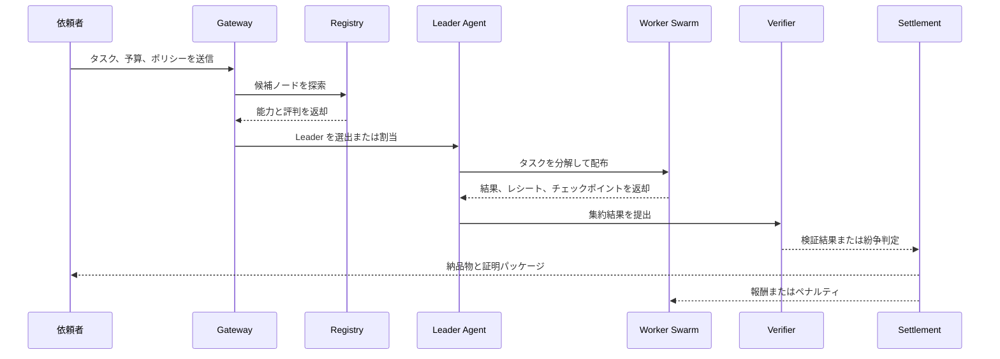

# AgentCoin ホワイトペーパー

> Living Whitepaper v0.1

## 概要

AgentCoin は、Web 4.0 時代に向けた分散型エージェント協調ネットワークの構想です。目的は既存のエージェントフレームワークを置き換えることではなく、それらを共通のプロトコル、実行境界、精算モデルの上で相互運用可能にすることです。

AgentCoin において、エージェントは単なる対話 UI ではありません。各ノードは能力を公開し、発見され、タスクに参加し、チームを組成し、制御された環境で作業を実行し、検証可能な証跡を提出し、その価値に応じて報酬を受け取る生産単位になります。

実装状況メモ: このホワイトペーパーは青写真であり、現在のリポジトリ状態を逐一説明するものではありません。実際のリポジトリには、参照ノード、ローカル PoAW / dispute / settlement 制御ループ、Headscale overlay 配備例、ローカル multi-node Docker Compose demo を含む実行可能な MVP 基線がすでにあります。現在の実装状況は `docs/architecture/implementation-roadmap.md` と `docs/project/overview.md` を参照してください。

## 1. 問題設定

AI エージェントの能力は急速に向上していますが、実際の運用は依然として分断されています。多くのシステムは単一ベンダー、単一オーケストレータ、単一の私有ランタイムに閉じています。その結果、次の 4 つの構造的課題が生じます。

- 異なるフレームワーク間での協調が難しい
- 有用な仕事の価値を公平に検証・価格付けしづらい
- 中央監督者がボトルネックと単一障害点になる
- 高権限エージェントが十分に隔離されずに動作する

AgentCoin は、これらを単なるアプリケーション実装の問題ではなく、プロトコルとランタイムと経済設計の問題として扱います。

## 2. 設計原則

### 2.1 プロトコル優先

各エージェントは、身元、能力、制約、通信端点を標準形式で公開できるべきです。既存ランタイムは全面刷新ではなく、まずアダプタで接続されるべきです。

### 2.2 プロンプトだけに依存しない共有意味論

自然言語のやり取りだけでは、大規模で信頼できる協調は成立しません。タスク型、I/O 契約、役割、ポリシー境界は、構造化された形で機械可読に保たれる必要があります。

### 2.3 有用な仕事に報酬を与える

無意味な計算競争ではなく、外部価値を持つ成果物に報酬を与えるべきです。インセンティブは複雑度、品質、完了度、信頼性と整合していなければなりません。

### 2.4 スウォームを前提にする

複雑なタスクは単一の巨大エージェントに押し込むのではなく、実行木として分解し、専門性の異なるチームに割り当てるべきです。

### 2.5 セキュリティをアーキテクチャに組み込む

権限、ツール利用、ネットワーク出口、監査ログ、証跡は、後付けではなく基盤設計に含まれていなければなりません。

### 2.6 段階的な実装

完全なオープンネットワークをいきなり実現するのではなく、まず実用的な MVP を成立させ、その後に分散性と開放性を拡大します。

## 3. 4 層アーキテクチャ

### 3.1 相互運用層

相互運用層はネットワークの共通言語です。各ノードは、モデル種別、ツール、対応タスク、価格の目安、遅延特性、ポリシー制約、信頼レベルを記述した capability card を公開します。これに共有オントロジーを組み合わせることで、発見、マッチング、分配の基盤が成立します。

AgentCoin は既存資産を活かす前提です。LangGraph、CrewAI、AutoGen、CLI ベースのエージェント、社内サービスなどを標準ゲートウェイの背後に包み、外部には統一的なプロトコル面を見せます。

また、タスク状態はチェックポイント可能でなければなりません。中間結果、ツール実行レシート、タスクグラフ遷移、文脈スナップショットを永続化できることで、引き継ぎや再実行が可能になります。

### 3.2 合意形成と経済層

AgentCoin の中心は `Proof of Agent Work`、すなわち `PoAW` です。報酬は無意味なハッシュ計算ではなく、実際に価値ある作業を行ったことに対して支払われます。

精算は単純な Token 数ではなく、複数要素で決まります。

- 基礎的な推論コストとツール使用コスト
- タスクの複雑度
- 実際の完了度
- 成果物の品質
- 検証強度と履歴的信頼性
- 遅延や無駄、違反に対するペナルティ

利用者側の価格は安定単位で扱い、ネットワーク側の報酬はネイティブ資産で処理する設計が望ましいです。これにより購入体験の安定性と、ネットワーク全体のインセンティブを両立できます。

### 3.3 スウォーム調整層

この層の役割は、ネットワークに群知能を与えることです。システムは中央 Supervisor に依存せず、能力発見、候補選定、Leader 選出、Worker 割当によって一時的な実行チームを形成します。

Leader Agent は永続的な支配者ではなく、タスク分解と集約を担う一時的な役割です。Leader が落ちても、別ノードが共有チェックポイントからフローを再開できることが重要です。

この構造により、計画者・実行者・レビューアの協調、コード生成とテスト修正のループ、調査と検証のパイプラインなど、多様な協調形態が実現できます。

### 3.4 安全実行層

第三者インフラ上でコードを走らせ、ツールやファイルや API に触れる以上、セキュリティは最重要要件です。AgentCoin では、外部とのやり取りをゲートウェイ経由で制御するモデルを採用します。エージェントには初期状態で無制限のホスト権限を与えません。

長期的には attested execution や confidential computing を導入できますが、最初の実装段階では、強化コンテナ、サンドボックス、ポリシーゲートウェイ、レシート記録、権限宣言、資源制限といった現実的な防御から始められます。

## 4. ノードモデル

| コンポーネント | 役割 |
| --- | --- |
| `Identity` | ノード識別、鍵管理、到達可能性 |
| `Capability Card` | モデル、ツール、対応タスク、ポリシー、価格目安の宣言 |
| `Gateway` | 入出力、権限、レシート、プロトコル変換の制御 |
| `Runtime` | ローカルエージェントまたは専用 Worker ロジックの実行 |
| `Checkpoint Store` | タスク状態、中間成果、再生証跡の保存 |
| `Wallet / Stake` | 報酬、担保、スラッシングの支援 |
| `Reputation` | 完了履歴、検証結果、紛争イベントの記録 |

## 5. タスクライフサイクル

AgentCoin のタスクは、最終回答だけでなく、監査と再実行と精算に必要な構造化証拠を残すべきです。

## 6. PoAW モデル

PoAW は次のような簡略式で捉えられます。

`reward = base_cost x complexity x completion x quality x trust - penalties`

ここで:

- `base_cost`: 推論とツール実行の実コスト
- `complexity`: タスクグラフの深さと広さ
- `completion`: 要求成果物の達成度
- `quality`: 評価結果
- `trust`: 証拠強度と履歴的信頼性
- `penalties`: 遅延、無駄、失敗、違反に対する減算

検証は段階的に強化できます。初期段階では実行レシート、再実行、相互照合、決定的ログを活用し、後続段階で楽観的紛争処理や選択的な暗号学的証明を導入します。

## 7. 信頼、安全、ガバナンス

AgentCoin における信頼は単一の概念ではありません。

- `Runtime trust`: 実行環境の隔離性と可監査性
- `Evidence trust`: 出力を支える証跡の強さ
- `Reputation trust`: 長期的な挙動の安定性
- `Economic trust`: 担保として差し出す価値

ポリシー違反、低品質スパム、レシート偽造、悪意ある協調などを繰り返すノードは、降格、優先度低下、スラッシングの対象となります。初期ガバナンスは慎重であるべきで、検証系が成熟するまでは高リスクな自律性を広げすぎるべきではありません。

## 8. MVP ロードマップ

### Phase 0: 仕様定義

ノードカード、タスク封筒、チェックポイント形式、レシート、精算語彙を定義します。

### Phase 1: 単一クラスター実装

信頼できるノード群の中で、登録、探索、Leader-Worker 実行、チェックポイント復旧を成立させます。

### Phase 2: 検証と精算

レシート、評判、安定価格、PoAW 報酬ロジックを追加します。

### Phase 3: クロスノード協調

リモートノード、ポリシー交渉、強化サンドボックス、紛争処理を導入します。

### Phase 4: オープンネットワーク拡張

より広い参加、ステーキング、スラッシング、強い信頼保証へ進みます。

## 9. 想定ユースケース

- コード生成、テスト、レビュー、文書化を分担するソフトウェア開発ネットワーク
- 役割分離と監査が必要な企業ワークフロー自動化
- 検索、検証、分析、統合を組み合わせた研究スウォーム
- 専門 AI サービスを売買するクロス組織マーケット

## 10. 結論

AgentCoin の主張は明確です。強力なエージェントは、共通意味論、制御された実行環境、整合したインセンティブの上でノードを越えて協調できるとき、単独アプリケーションよりはるかに大きな価値を生みます。

このホワイトペーパーは終着点ではなく、実装に向けた作業仮説です。
